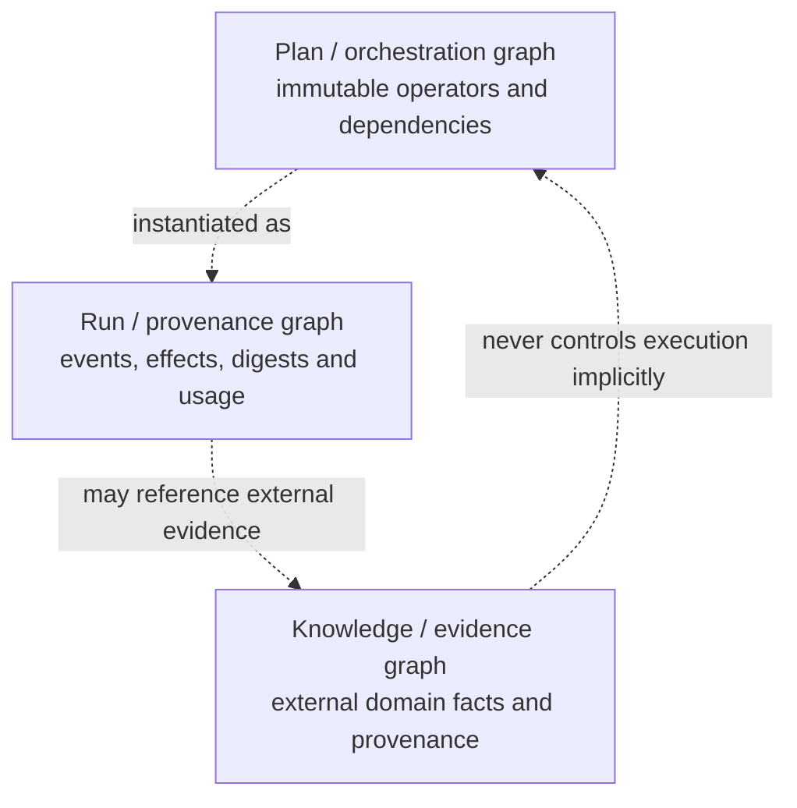

# Measured Plan Kernel architecture

## Compiler and execution pipeline

```mermaid
flowchart LR
  JSON["Untrusted JSON"] --> PARSE["Parse + Zod wire validation"]
  PARSE --> NORMALIZE["Normalize IDs + graph"]
  NORMALIZE --> CHECK["Resolve catalog + type-check"]
  CHECK --> ANALYZE["Effects, capabilities + resource proofs"]
  ANALYZE --> CANON["Plan + catalog fingerprints"]
  CANON --> ARTIFACT["Opaque ExecutablePlan"]
  ARTIFACT --> EXEC["Pure / mock / replay interpreter"]
  EXEC --> TRACE["Separate typed provenance trace"]
```

Every arrow strengthens the value's guarantees. Parsing accepts text and returns
only a validated wire document. Normalization builds a `ReadonlyMap`, detects
identity/reference failures, and establishes topological order. Checking proves
nominal schema compatibility at every edge. Analysis must prove every relevant
maximum and policy inclusion before execution. Compilation snapshots the catalog
and binds analysis, the plan hash, catalog fingerprint, capability set, and
budget into an opaque `ExecutablePlan`. Execution accepts only that artifact and
independently enforces capabilities, actual usage, and runtime schemas.

The public package does not export normalization, checking, or analysis entry
points. Callers cannot pair artifacts from separate compilations or substitute a
catalog at execution time.

## Three graphs

This milestone implements the plan graph and an in-memory run graph. It does not
implement the knowledge graph. A future backend may link evidence handles into
traces, but knowledge relationships never become scheduling edges.

## Catalog trust boundary

Plans see only stable IDs and versions. Generic registration builders retain
typed implementations in closures. Their erased runtime functions accept
`unknown`, validate through the registered input schema, invoke typed code, and
validate output before returning `unknown`. The heterogeneous catalog therefore
does not require `any`, covariance assertions, or model-authored code.

Schema compatibility is conservative and nominal. Equal identities are
compatible; collection element compatibility comes from registered collection
metadata. There is no coercion or structural-subtyping guess.

Catalog tokens hold frozen snapshots. Their canonical manifest fingerprints all
schema descriptions and JSON Schemas, operation signatures, effect declarations,
bounds, and reducer laws. The generator-facing `PlanLanguageManifest` combines
that catalog fingerprint with the plan JSON Schema and the available policy.

## Bounds

Mapped effect calls are multiplied by the source collection's proven maximum.
`select` unions possible effects/capabilities but uses the maximum branch cost,
because one statically present branch executes. `boundedFix` contributes its
hard iteration maximum and performs no undeclared effect. Unknown cardinality
that reaches a relevant resource calculation rejects the plan.

The static report is conservative. It predicts maxima, not actual usage. The
trace records actual calls, tokens, wall-clock usage reported by effect
handlers, recursion depth, and parallelism.

## Portability

The kernel targets ES2022 with `ES2023` and `WebWorker` declarations and an
empty ambient `types` set. It uses `crypto.subtle`, `TextEncoder`, and injected
time/identity providers. The CLI alone owns filesystem and process behavior.
Compatibility fixtures consume built public exports in Node and through a real
Wrangler/Workers bundle.

## Current guarantee boundary

Canonical identity is syntactic, not semantic: object key order is normalized,
array order remains significant, and all plan/catalog/policy references in the
wire document contribute to the hash. Equivalent programs are not promised the
same hash.

Replay reuses recorded external results only when the effect request hash
matches. That hash binds the plan, catalog, operation version, node/invocation,
effect name, and input digest. Recorded output digests are checked before a
value is returned. Replay does not claim that rerunning a provider would
reproduce a recording, nor that a semantically incorrect recorded answer becomes
correct.
