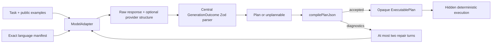

# M1a plan-generation benchmark

M1a tests whether a provider-neutral model adapter can propose useful Lachesis
plans. It does not call a live model and it does not claim that plan generation
is reliable yet. Live provider comparisons belong to M1b after this substrate is
frozen.

## Trust boundary

The generation loop is:

Only a compiled opaque artifact reaches hidden execution. A rejected plan,
including one denied by capability or budget policy, is scored without being
executed. Repair requests contain exactly the original task, public task-input
declarations, exact manifest, previous proposal, and structured compiler
diagnostics. A declaration contains only an input name, schema reference, and
declared bounds. Hidden input values, expected outputs, effect results, and
semantic scores are excluded from both initial and repair requests.

M1c adds public typed semantic obligations to both request kinds. They expose
task intent without hidden examples: root input dependencies, required
operations/effects, operation dominance, and trusted state-change requirements.
The compiler checks them after graph/resource analysis. An `unplannable` outcome
carries a typed missing-operation, denied-capability, or insufficient- budget
witness; the generator validates it against the public obligations, exact
manifest, and trusted policy before crediting abstention.

M1b.5 makes the authority boundary structural. The model-authored proposal may
contain only registered operator topology and arguments. It cannot declare a
budget, capability authorization, or a narrower input collection bound. The
benchmark/runtime binds the complete public input bounds and trusted policy, the
analyzer derives required resources and capabilities, and the compiler compares
those requirements with the trusted limits. Legacy wire declarations remain
readable, but they are not authority.

Adapters do not decide whether model output is valid. For unconstrained methods,
the generator parses `rawResponse` itself. For constrained methods, it validates
the optional provider-decoded value with the same `generationOutcomeSchema`.
Malformed or schema-invalid model output is recorded as `invalidOutput` and may
be repaired; only transport failures are adapter failures. This keeps parse
success comparable across providers.

## Frozen substrate

`loadM1aCorpus()` returns 42 deeply frozen, content-addressed cases over four
unrelated catalogs:

- numeric map/filter/fold and effect tasks;
- text normalization, filtering, folding, and translation tasks;
- boolean branching tasks;
- bounded fixed-point workflow tasks;
- ten intentionally impossible capability, budget, or missing-operation tasks.

The exported holdout declaration reserves an entire workflow catalog, several
operator combinations, and several phrasings. Case digests bind instructions,
policy, public task-input declarations, public examples, hidden evaluations,
feasibility, properties, and forbidden capabilities. Language manifests are
independently content-addressed by the kernel. `partitionM1aCorpus()` creates
non-overlapping development, catalog-holdout, combination-holdout, and
phrasing-holdout sets, with whole catalog holdout taking precedence.

Recorded-provider fixtures cover direct compilation, compiler-guided repair, and
correct abstention. They are validated, deeply frozen, and content-addressed
before use.

Materialization resolves every public schema and required schema, operation,
effect, and input reference against the exact catalog. Each plannable fixture
also has a deterministic offline reference proposal that must compile and pass
its hidden properties after trusted public bounds are bound. These witnesses
prove benchmark validity; they are never included in model prompts. A blind
held-out integrity audit exposes numeric validity counts only, so fixture
development cannot inspect held-out identities, instructions, inputs, or
expected results.

Every unplannable fixture carries a typed infeasibility witness. Missing-
operation witnesses prove the required reference is absent and rejected by the
compiler. Capability and budget witnesses identify a registered required
operation and prove that trusted policy rejects its minimal topology with the
expected diagnostic. The blind audit counts these proofs separately from
plannable compilation and hidden-property results. Compilation and hidden
semantic success are also independent counters: a compiled witness with a bad
hidden result increments only compilation.

Every new run requires a deeply frozen `ExperimentManifest` (format version 3;
version 2 remains readable for immutable resume). Its digest binds the case set
and split digests, prompt and protocol content digests, provider/model and
adapter version, inference settings, structured-output mode, methods,
repetitions, call/token/cost caps, Git/package versions, and a separately
content-addressed pricing snapshot. The runner verifies the manifest, pricing
digest, provider cap bindings, and exact case/method coverage before the first
request.

## Behavioral scoring

The runner evaluates behavior rather than exact AST equality. Each accepted plan
runs against multiple hidden inputs and deterministic effect fixtures. Required
plan properties and forbidden capabilities are checked separately. This catches
constant-answer plans while allowing different valid decompositions.

Every canonical run record contains raw model responses, compiler diagnostics,
attempt and repair counts, parse/wire/compile outcomes, token and micro-dollar
usage, cached and cache-write input tokens, reasoning tokens where reported,
latency, returned model and provider request/response identifiers, hidden
semantic results, split identity, and a node-name-independent topology digest.
Provider safety refusals are distinct from a model's Lachesis `unplannable`
outcome. Resumption keys derive from the experiment digest, case, split, method,
and repetition; there is no caller-chosen run ID. The Node store verifies
content digests and writes records atomically in canonical key order.

Before every provider invocation, the runner temporarily reserves the method's
maximum input and output tokens at the most expensive applicable frozen input
rate. It checks the total call, token, dollar, per-call output, and per-provider
dollar caps before allowing the adapter call, then reconciles the reservation
against returned usage. Cost is recomputed from the frozen pricing snapshot; an
adapter cannot supply a cheaper cost. Every adapter result records whether it
was not dispatched, dispatched with usage, or dispatched with unknown usage.
Pre-dispatch failures settle at zero. If a dispatched request fails without
usage, the worst-case reservation is retained as authorized conservative
accounting. A denied reservation never reaches the provider.

M1a supports these live-comparison method labels without embedding provider
SDKs:

1. unconstrained JSON;
2. JSON-Schema-constrained generation;
3. constrained generation with compiler-guided repair.

CodeMode is represented in the record schema but remains an unevaluated M1b
baseline.

## Research gates

`evaluateResearchGates()` reports, but does not waive, the milestone gates:

- zero execution of rejected or unauthorized plans;
- at least 90% first-attempt compilation on held-out plannable cases;
- at least 98% compilation after no more than two repairs;
- at least 90% semantic success on hidden deterministic inputs;
- at least 90% correct abstention on impossible cases;
- among shared initial proposals that fail compilation or a typed obligation,
  repair adds at least ten percentage points of semantic executable-plan success
  or halves the failure rate;
- functional IR materially outperforms CodeMode on repair turns and runtime
  failures before making the broader claim.

Development records are excluded from every research gate. The compile,
semantic, and abstention thresholds are evaluated on held-out
JSON-Schema-with-repair records. Repair uplift and CodeMode comparisons require
identical experiment, case, model configuration, repetition keys, and initial
proposal digests; missing, duplicate, or independently sampled coverage makes
the comparative gate unevaluated. If no shared proposal is eligible, reporting
says `repair unnecessary` rather than treating zero uplift as failure. Rate
reports include success counts, sample counts, and 95% Wilson confidence
intervals.

The portable entrypoint targets ES2022 with WebWorker declarations and no Node
ambient types. Filesystem persistence is compiled separately behind `./node`.
The Workers compatibility bundle exercises generation with the recorded adapter.

## M1b provider substrate

`@nicia-ai/lachesis-generator-ai-sdk` is a separate Node-only package pinned to
Vercel AI SDK 7. The primary comparison uses OpenAI Responses with
`gpt-5.6-terra` at low reasoning effort and direct Anthropic Messages with
`claude-sonnet-5` at adaptive/low thinking. An Anthropic-on-AWS-Bedrock adapter
remains available as an optional secondary route. No model SDK enters the kernel
or portable generator.

The pilot constants encode a $50 total cap, $25 per billing provider, 400 calls,
5,000,000 input tokens, 1,000,000 output tokens, 8,192 output tokens per call,
and two-provider pricing entries. AI SDK retries are disabled so every recorded
model attempt corresponds to at most one billable provider request. Importing
the package never starts inference.

The primary method identities record the reasoning configuration and direct
provider routes. AWS Bedrock is excluded from the primary comparison and cannot
silently substitute for direct Anthropic. No live calls or frozen held-out
experiment are made by this substrate; prompt calibration remains
development-only and precedes the separately frozen held-out manifest.

M1b.4 separates runtime validation from provider transport. A versioned compiler
builds a strict root-object schema from each exact language manifest, inlines
wire alternatives, constrains catalog references and constants, and rejects
unsupported schema dialects before reservation. The compiler version and schema
digest are bound into the experiment and every constrained request. Anthropic's
`json` tool is an internal structured-output transport, not an external tool.

M1b.5 transport schemas describe the computation proposal rather than the final
trusted wire plan. Provider schemas therefore omit policy budgets, capability
authorization, and input `maxItems`; those fields are bound locally before
analysis and compilation. The workflow catalog and its operations share the same
`1.1.0` version, and its public state domain is bounded to the trusted
fixed-point limit.

The deterministic fixtures prove the measurement machinery, not these empirical
rates. Prompts, cases, manifests, scoring code, providers, capability tiers,
repetition count, and a hard spend cap must be frozen before the M1b pilot.

## M1b controlled execution

The Node-only `apps/benchmark` controller wraps experiment manifests in a
content-addressed campaign and phase protocol. Smoke and calibration share one
durable $10 pool across manifests. Held-out has a separate $50 total pool with
$25 OpenAI and Anthropic subcaps. A hash-chained append-only ledger reserves
worst-case cost before every request, reconciles provider-reported usage,
separates it from authorized conservative missing-usage charges, validates a
durable head, and is protected by an exclusive stale-aware filesystem lock.

Phase validation prevents development/held-out mixing, rejects Bedrock and
model-setting drift from the primary matrix, and requires a clean matching Git
commit for held-out and the two-call transport probe. Live execution requires
exact experiment, phase, and pool cap acknowledgement. Dry-run and reporting do
not construct provider models or make network requests. The operational protocol
is in [`m1b-runbook.md`](m1b-runbook.md).
