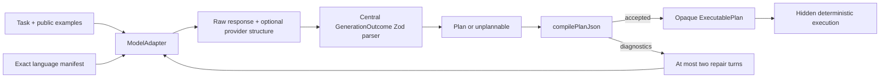

# M1a plan-generation benchmark

M1a tests whether a provider-neutral model adapter can propose useful Lachesis
plans. It does not call a live model and it does not claim that plan generation
is reliable yet. Live provider comparisons belong to M1b after this substrate is
frozen.

## Trust boundary

The generation loop is:

Only a compiled opaque artifact reaches hidden execution. A rejected plan,
including one denied by capability or budget policy, is scored without being
executed. Repair requests contain exactly the original task, exact manifest,
previous proposal, and structured compiler diagnostics. Public examples, hidden
inputs, effect results, and semantic scores are excluded from repair.

Adapters do not decide whether model output is valid. For unconstrained methods,
the generator parses `rawResponse` itself. For constrained methods, it validates
the optional provider-decoded value with the same `generationOutcomeSchema`.
Malformed or schema-invalid model output is recorded as `invalidOutput` and may
be repaired; only transport failures are adapter failures. This keeps parse
success comparable across providers.

## Frozen substrate

`loadM1aCorpus()` returns 42 deeply frozen, content-addressed cases over four
unrelated catalogs:

- numeric map/filter/fold and effect tasks;
- text normalization, filtering, folding, and translation tasks;
- boolean branching tasks;
- bounded fixed-point workflow tasks;
- ten intentionally impossible capability, budget, or missing-operation tasks.

The exported holdout declaration reserves an entire workflow catalog, several
operator combinations, and several phrasings. Case digests bind instructions,
policy, public examples, hidden evaluations, feasibility, properties, and
forbidden capabilities. Language manifests are independently content-addressed
by the kernel. `partitionM1aCorpus()` creates non-overlapping development,
catalog-holdout, combination-holdout, and phrasing-holdout sets, with whole
catalog holdout taking precedence.

Recorded-provider fixtures cover direct compilation, compiler-guided repair, and
correct abstention. They are validated, deeply frozen, and content-addressed
before use.

Every run requires a deeply frozen `ExperimentManifest`. Its digest binds the
case set and split digests, prompt and protocol content digests, provider/model
and adapter version, inference settings, structured-output mode, methods,
repetitions, call/token/cost caps, and Git/package versions. The runner verifies
the manifest and exact case/method coverage before the first request.

## Behavioral scoring

The runner evaluates behavior rather than exact AST equality. Each accepted plan
runs against multiple hidden inputs and deterministic effect fixtures. Required
plan properties and forbidden capabilities are checked separately. This catches
constant-answer plans while allowing different valid decompositions.

Every canonical run record contains raw model responses, compiler diagnostics,
attempt and repair counts, parse/wire/compile outcomes, token and micro-dollar
usage, latency, hidden semantic results, split identity, and a node-name-
independent topology digest. Resumption keys derive from the experiment digest,
case, split, method, and repetition; there is no caller-chosen run ID. The Node
store verifies content digests and writes records atomically in canonical key
order.

M1a supports these live-comparison method labels without embedding provider
SDKs:

1. unconstrained JSON;
2. JSON-Schema-constrained generation;
3. constrained generation with compiler-guided repair.

CodeMode is represented in the record schema but remains an unevaluated M1b
baseline.

## Research gates

`evaluateResearchGates()` reports, but does not waive, the milestone gates:

- zero execution of rejected or unauthorized plans;
- at least 90% first-attempt compilation on held-out plannable cases;
- at least 98% compilation after no more than two repairs;
- at least 90% semantic success on hidden deterministic inputs;
- at least 90% correct abstention on impossible cases;
- repair adds at least ten percentage points of semantic executable-plan success
  or halves the failure rate;
- functional IR materially outperforms CodeMode on repair turns and runtime
  failures before making the broader claim.

Development records are excluded from every research gate. The compile,
semantic, and abstention thresholds are evaluated on held-out
JSON-Schema-with-repair records. Repair uplift and CodeMode comparisons require
identical experiment, case, model configuration, and repetition keys; missing or
duplicate coverage makes the comparative gate unevaluated. Rate reports include
success counts, sample counts, and 95% Wilson confidence intervals.

The portable entrypoint targets ES2022 with WebWorker declarations and no Node
ambient types. Filesystem persistence is compiled separately behind `./node`.
The Workers compatibility bundle exercises generation with the recorded adapter.

The deterministic fixtures prove the measurement machinery, not these empirical
rates. Prompts, cases, manifests, scoring code, providers, capability tiers,
repetition count, and a hard spend cap must be frozen before the M1b pilot.
