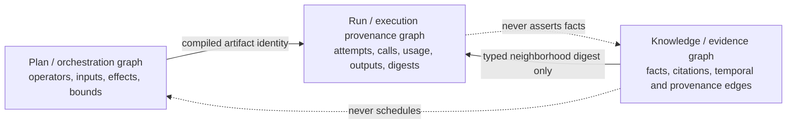

# M3a: offline graph-native decomposition design

Status: offline design substrate; no provider calls, TypeGraph dependency, live
campaign, or inference authorization.

M3a prepares a matched comparison of evidence-selection substrates while holding
the rest of Lachesis fixed:

```text
Same functional IR
Same planner and models
Same reducers and budgets
Same expected evidence schema

Text-selected evidence
        versus
Graph-selected evidence neighborhoods
```

The current milestone is deliberately deterministic. It proves that both arms
obey one public contract, that the generic graph arm preserves the benchmark's
typed relationships, and that negative controls do not receive a graph bonus. It
does not measure model behavior and cannot support a TypeGraph, semantic, or
production claim.

## Substrate-neutral contract

`@nicia-ai/lachesis-evidence` defines one `EvidenceSource` interface. A source
accepts a bounded `EvidenceQuery` and returns
`Result<EvidenceNeighborhood, EvidenceSourceFailure>`. Both text and graph arms
return the same strict schema:

- validated evidence facts with explicit validity intervals and active or
  retracted status;
- citations with source, locator, and observation time;
- typed evidence edges;
- evidence paths expressed as ordered fact and edge identities; and
- the query and source identities used to select the neighborhood.

Queries bound facts and graph hops. The common validator rejects malformed
queries, mismatched query identities, invalid neighborhoods, and bound
violations. `referenceEvidenceSelection` creates a canonical SHA-256 selection
reference. That reference is suitable for later run provenance, but it is not a
plan hash and cannot affect scheduling implicitly.

The two reference implementations consume the same frozen facts and citations:

- `matched-rendered-chunks/1` renders one deterministic text chunk per fact and
  ranks chunks lexically;
- `in-memory-reference-graph/1` uses the same lexical seed signal and bounded
  graph expansion, returning only paths present in the supplied graph.

No implementation imports a provider SDK, filesystem API, environment API,
network API, or TypeGraph.

## Three separate graphs



The plan graph remains owned by `@nicia-ai/lachesis`. The evidence graph is
owned by `@nicia-ai/lachesis-evidence`. Execution traces remain run-provenance
records. Cross-graph links are typed content references, never shared nodes or
implicit control edges. In particular:

- evidence edges cannot invoke operations or effects;
- plan nodes cannot masquerade as evidence facts;
- execution events cannot rewrite evidence; and
- a changed evidence neighborhood changes its own digest without changing the
  plan-only `planHash`.

## Deterministic corpus and ground truth

The M3a reference corpus is new and synthetic; it does not reuse inspected M1b,
M1c, or M2 held-out cases. Its seven tasks cover:

| Category         | Frozen ground truth                                      |
| ---------------- | -------------------------------------------------------- |
| Multi-hop        | employer → headquarters                                  |
| Temporal         | beta → stable supersession                               |
| Contradiction    | raw high reading → contradictory audited normal reading  |
| Provenance       | dispatch report → corroborating warehouse receipt        |
| Retraction       | retraction notice → old policy → superseding policy      |
| Negative control | direct project-owner lookup, no expected graph advantage |
| Negative control | direct build-color lookup, no expected graph advantage   |

Every task freezes expected fact identities, citation identities, evidence
paths, and an answer witness. Answer witnesses are audit ground truth only; they
are never supplied to `EvidenceSource.select`.

The offline audit validates graph referential integrity, task coverage,
selection bounds, exact schema conformance, deterministic repeated selection,
invariance to graph storage order, graph path recall, and negative-control
parity. The frozen reference audit passes:

- 7/7 tasks valid;
- 14/14 repeated arm selections deterministic;
- graph fact, citation, and path recall all 1.0;
- explicit graph-path advantage on 5/5 structural tasks; and
- matched evidence on 2/2 negative controls.

The text arm has no graph paths by construction. That is a representation fact,
not yet evidence of downstream task benefit.

## Prospective M3b hypotheses

These hypotheses are design inputs, not an external preregistration. Exact
sample sizes, intervals, margins, and spending caps must be frozen separately
before any live access.

1. On structural tasks, graph-selected neighborhoods improve paired semantic
   success or evidence-path correctness over matched text selection.
2. On negative controls, the graph arm is semantically non-inferior and does not
   increase repair, cost, latency, or evidence volume beyond a frozen margin.
3. Citation correctness improves only when the selected graph path contains the
   cited supporting facts; mere presence of an edge earns no credit.
4. Benefits persist within relational, temporal, contradiction, provenance, and
   retraction strata rather than arising from one category.
5. Static predicted evidence bounds reconcile with selected fact, edge, path,
   and citation counts in both arms.

## Planned ablations

M3b should keep the functional IR, prompts, providers, model settings, public
contracts, hidden evaluations, reducers, repair limit, and budgets identical.
The paired schedule must counterbalance substrate order and preserve it on
resume. Planned offline and live ablations are:

- matched rendered text chunks;
- generic graph adjacency without typed temporal/provenance semantics;
- the complete generic typed graph;
- edge-shuffled and edge-removed negative ablations;
- fixed-size versus fixed-token neighborhoods; and
- later, the same adapter contract backed by TypeGraph.

No arm may receive a larger fact, token, hop, call, repair, or cost budget
merely because it is graph-backed.

## Metrics

Evidence-level metrics are fact recall and precision, citation recall and
precision, exact path recall, invalid or unsupported citations, neighborhood
size, hop count, retracted-fact handling, contradiction coverage, deterministic
selection, and predicted-versus-actual selection resources.

Matched downstream metrics are parse and compilation success, first and final
semantic success, correct typed abstention, repair eligibility and uplift,
runtime failures, unauthorized capability attempts, tokens, provider-reported
usage, observed and conservative cost, and latency. Results must be paired by
case, provider, and repetition and stratified by task category.

## Offline gates and kill criteria

M3b materialization is blocked unless:

- every corpus item and evidence reference validates;
- both sources are deterministic and portable under Node 24 and Workers;
- the generic graph source achieves complete frozen path and citation recall;
- both negative controls have exact arm parity;
- source identities and neighborhood digests are frozen;
- the expected evidence schema and all per-task budgets are identical; and
- the workspace contains no TypeGraph dependency.

Kill or redesign the comparison if graph benefit disappears under equal
neighborhood budgets, depends on leaking answer/path ground truth into queries,
changes negative controls, cannot reconcile resource use, or comes only from
returning more evidence. A failed generic graph arm is not grounds to integrate
TypeGraph.

## TypeGraph adapter design and gate

A future adapter may implement `EvidenceSource` by translating a bounded query
into a TypeGraph neighborhood request and normalizing the response into the
exact existing `EvidenceNeighborhood` schema. The adapter must:

1. accept only the already validated query and explicit capability-scoped
   connection supplied by the host;
2. enforce the same fact and hop limits before and after the backend request;
3. reject unknown edge kinds, missing citations, dangling paths, backend-native
   objects, and unstable ordering;
4. include adapter and backend schema versions in source identity;
5. expose no TypeGraph handle to the planner, kernel, or plan wire format; and
6. support record/replay at the neighborhood boundary without treating replay as
   fresh evidence.

The integration gate is non-negotiable:

> TypeGraph must add temporal, provenance, querying, or replay value beyond the
> substrate-neutral graph implementation; it must not receive credit merely for
> storing the benchmark graph.

If the generic graph arm does not demonstrate useful additive behavior first,
TypeGraph remains deferred. Only after the deterministic corpus and both generic
substrate arms pass offline audits may M3b introduce bounded model calls under a
new campaign, external preregistration, and separate explicit authorization.
