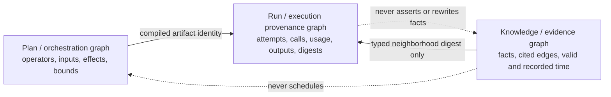

# M3a.1: offline evidence-substrate benchmark hardening

Status: offline design only. M3b is blocked. There are no provider calls,
provider SDKs, TypeGraph dependencies, live campaign identities, or inference
authorization in this milestone.

The original seven-case M3a implementation was a useful contract smoke test, but
not a valid retrieval experiment. Its queries contained answer-bearing terms,
the text arm could not emit paths by construction, graph selection and
relationship encoding changed together, relationships lacked independent
provenance, and context growth was not fully bounded. The reported 5/5 path
advantage is therefore historical contract-verification evidence only. It is not
evidence that graph retrieval improves task performance.

M3a.1 replaces that design with a frozen factorial comparison:

```text
Same functional IR, planner, models, reducers, and execution budgets
Same public instruction and evidence contract
Same per-task fact, citation, edge, path, hop, byte, and token limits

1. Lexically selected rendered facts
2. Graph-selected facts, relationships hidden
3. The same graph-selected facts plus untyped adjacency
4. The same graph-selected facts plus typed edges and paths
```

This separates two questions that the original design conflated:

1. Does graph traversal retrieve better facts than lexical selection?
2. Given identical facts, does explicit adjacency or typed relationship encoding
   add value?

## Leakage boundary

Every `EvidenceQuery.text` is exactly the public task instruction. Answers,
expected facts, expected citations, expected edges, and expected paths remain
audit-only fields. A counts-only blind audit checks instruction/query equality,
protected answer terms, split/category coverage, duplicate identities, and
dangling ground truth without returning held-out contents or identifiers.

The corpus deliberately includes misleading lexical matches, disconnected
components, and noisy cited edges. Selection can use only the independently
authored public instruction and the source data. Any answer-bearing query term
is a kill condition.

## Bounded substrate-neutral contract

`@nicia-ai/lachesis-evidence` exposes one `EvidenceSource` interface. A source
accepts a validated `EvidenceQuery` and returns
`Result<EvidenceNeighborhood, EvidenceSourceFailure>`. A query hard-bounds:

- facts and citations;
- edges and paths;
- traversal hops;
- canonical serialized UTF-8 bytes; and
- a conservative serialized-token upper bound.

The current portable token upper bound is one token per serialized UTF-8 byte.
It intentionally overestimates rather than claiming tokenizer precision. Facts,
their citations, edge-provenance citations, edges, and paths are added in stable
order. Each addition is measured against the complete canonical context. Items
that do not fit are deterministically omitted and the context is marked
truncated. Path enumeration stops at the declared path cap, so a dense legal
graph cannot cause unbounded combinatorial materialization.

The public validator independently recomputes all counts and serialization
measurements and rejects identity, encoding, reference, hop, or budget
misreconciliation. `referenceEvidenceSelection` produces a canonical digest for
run provenance; it is not a plan hash and does not grant execution authority.

## Four factorial arms

| Arm               | Selection                                      | Returned relationship information                  | Isolated question      |
| ----------------- | ---------------------------------------------- | -------------------------------------------------- | ---------------------- |
| `lexical-facts`   | lexical ranking of actual rendered fact chunks | none                                               | matched text baseline  |
| `graph-facts`     | lexical seed plus bounded graph expansion      | none                                               | graph retrieval        |
| `graph-adjacency` | identical graph-selected facts                 | endpoints and independently cited, unlabeled edges | connectivity           |
| `graph-typed`     | identical graph-selected facts                 | cited typed edges and paths                        | relationship semantics |

The three graph arms are required to return the same ordered fact set for every
task. Adjacency edges carry `relationship: null`; typed edges retain their
validated relationship. Paths appear only in the typed arm. This makes an
encoding comparison interpretable without pretending that a text-only object
should naturally contain graph paths.

Edge and edge-citation suffixes are neutral (`link-01`, `link-02`), and all edge
citations use the generic `evidence-link-register` source. A hostile test
rejects typed relationship vocabulary in metadata added by the adjacency arm;
nulling the `relationship` field alone is not treated as sufficient isolation.

## Temporal and provenance model

Facts and edges use separate valid-time and recorded-time intervals:
`validFrom`/`validUntil` describe the world interval, while
`recordedFrom`/`recordedUntil` describe when the evidence store held that
record. Retraction is represented by closing the old record interval and adding
the replacement record. A query can therefore reconstruct belief before or after
a recorded retraction instead of treating a retracted fact as invalid for all
history.

Every relationship has one or more independent provenance citations. Returning
an edge requires its supporting citations to fit in the same context budget.
Labels such as `contradicts`, `corroborates`, `retracts`, and `supersedes`
cannot appear as uncited benchmark assertions.

## Three separate graphs



The kernel plan graph, external evidence graph, and run-provenance graph remain
structurally distinct. Evidence edges cannot invoke operations; plan nodes
cannot masquerade as evidence; execution events cannot rewrite knowledge.

## Frozen deterministic corpus

The synthetic corpus is disjoint from M1b, M1c, M2, and the superseded M3a smoke
fixtures:

| Split       | Multi-hop | Temporal | Contradiction | Provenance | Retraction | Negative controls | Total |
| ----------- | --------: | -------: | ------------: | ---------: | ---------: | ----------------: | ----: |
| Development |         5 |        5 |             5 |          5 |          5 |                 5 |    30 |
| Held-out    |        20 |       20 |            20 |         20 |         20 |                40 |   140 |

Ground truth includes facts, fact citations, edges, edge-provenance citations,
paths, and answer witnesses. The offline audit passes all 170 tasks and 680
factorial selections:

- zero query/instruction mismatches or protected-answer leaks;
- 75 preregistered graph-retrieval-advantage cases;
- 95 retrieval-parity cases;
- 125 relationship-encoding cases;
- 45 negative controls with exact arm parity;
- complete typed-edge, edge-citation, and path recall;
- deterministic repeat selection and graph-storage-order invariance; and
- zero context-bound or reconciliation violations.

These are benchmark-construction results, not model-performance results.

## Prospective analysis and hypotheses

No live study is authorized. If M3b is later designed, repetition one is the
primary analysis and repetition two is an independent confirmation; repetitions
must not be pooled. Per provider and repetition, the frozen held-out substrate
contains 100 structural case units and 40 negative controls.

Prospective analyses use a 95% Tango paired risk-difference interval with a −10
percentage-point non-inferiority margin and an exact two-sided McNemar test for
superiority. A superiority claim additionally requires at least 20 discordant
pairs. Frozen sensitivity values are:

- 100 structural units, zero adverse pairs: lower bound −0.0369935;
- 100 structural units, four adverse pairs: lower bound −0.0983707;
- 100 structural units, five adverse pairs: lower bound −0.1117505; and
- 40 negative controls, zero adverse pairs: lower bound −0.0876216.

The prospective hypotheses are:

1. Graph-selected facts improve paired evidence recall over lexical facts on
   preregistered retrieval-advantage tasks.
2. Untyped adjacency isolates connectivity value over identical graph-selected
   fact sets.
3. Typed relationships and paths add semantic or citation value over identical
   graph-selected facts and adjacency.
4. Graph arms remain non-inferior on negative controls under identical context
   and execution limits.

Metrics must separately cover evidence recall/precision, citation validity, path
correctness, first/final semantic success, repairs, runtime and capability
failures, context resources, provider usage, cost, and latency. Analyses remain
paired by case/provider and stratified by category.

## M3b kill gates

M3b may not begin unless the frozen offline audit continues to prove:

- zero answer-bearing query leakage;
- byte-identical public instruction and selection query;
- equal maximum context budgets across matched arms;
- identical fact selections across all graph encoding arms;
- independently cited typed relationships;
- deterministic resource reconciliation and truncation;
- exact negative-control parity; and
- no TypeGraph or provider-SDK dependency in the evidence package.

Kill or redesign the comparison if graph benefit disappears under equal budgets,
comes only from extra context, changes negative controls, lacks enough
discordant pairs, or depends on one task category. Passing these offline gates
still does not authorize model calls.

## Deferred TypeGraph adapter

A future TypeGraph adapter may implement `EvidenceSource` only after the generic
graph arm demonstrates useful additive behavior. It must preserve the exact
contract, bounds, ordering, temporal semantics, provenance validation, and
record/replay boundary while exposing no backend handle to the planner or wire
format.

The integration gate remains:

> TypeGraph must add temporal, provenance, querying, or replay value beyond the
> substrate-neutral graph implementation; it must not receive credit merely for
> storing the benchmark graph.

Only a separate M3b design, external preregistration, campaign, budget review,
and explicit live authorization could permit bounded provider calls.
