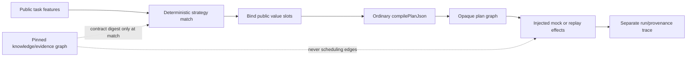
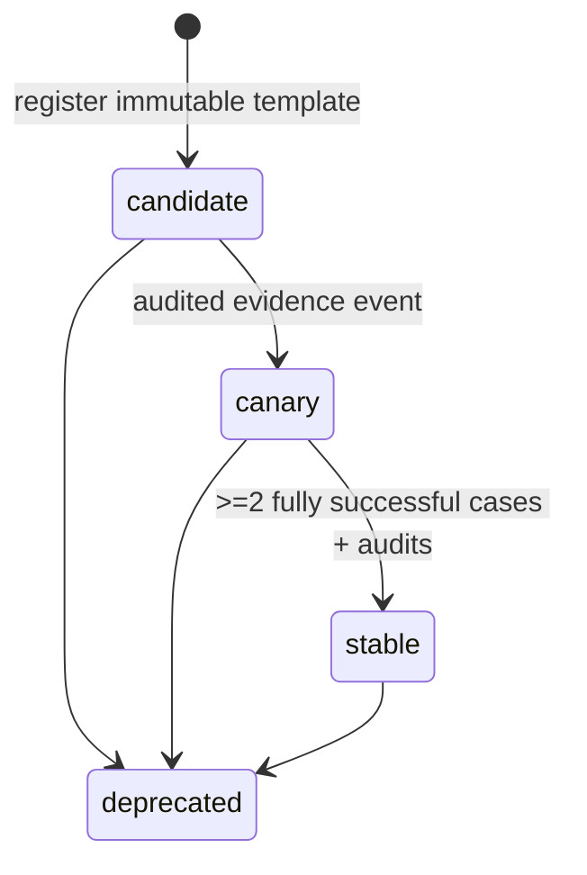

# M6a–M6d: compositional harness, conformance, and paired-study design

Status: **complete-design-no-go**. M6a–M6d makes no provider call, creates no
campaign, training run, live manifest, preregistration, or spending authority,
and does not change any frozen M1–M5 artifact.

## Motivation and claim boundary

The 2026 harness result described by Zhang and Khattab suggests that a harness
can make superficially different tasks share a decomposition trajectory. The
OpenProse/Press practitioner description calls a related workflow “gradual
calcification of the How.” Lachesis can test the engineering substrate behind
that idea without adopting unrestricted recursive Python, model-authored code,
or a learned-generalization claim.

M6 distinguishes three things:

- **Execution reuse** instantiates a previously validated typed skeleton and
  compiles it again. This milestone implements and tests this behavior.
- **Harness transfer** means that a public task is safely classified into the
  same declared strategy contract. M6 supports a narrow application-declared
  task class inside one exact trusted catalog.
- **Learned generalization** would mean that a trained model discovers or
  transfers the strategy. M6 performs no training and establishes no such
  result.

The coding-agent guardrails paper is treated as scoped evidence. Lachesis keeps
capabilities, budgets, semantic obligations, evidence sufficiency, recursion,
and promotion gates in code. It does not infer that the paper transfers to plan
or oracle quality, and it does not rewrite production prompts.

## Placement and trust boundaries

The implementation is an experimental portable surface in
`@nicia-ai/lachesis-generator`. The stable-alpha runtime facade is unchanged.
The kernel's opaque `compilePlanJson`/`ExecutablePlan` boundary is unchanged,
and normalization consumes a successful executable only to prove that the source
plan and exact catalog already compiled. No normalization, checker, or analyzer
internal was made public.

The implementation remains backend-neutral and uses Web Platform APIs. It has no
provider SDK, TypeGraph, Node built-in, `Buffer`, process, credential, or
network dependency. The three graph domains remain separate:

Templates contain no callbacks, source text, operations outside the catalog, raw
evidence, effect results, expected answers, credentials, provider identity, or
hidden evaluation properties. Slots can target only a registered-schema constant
value. The slot union has no authority, capability, budget, bound, recursion,
evidence-access, promotion, or lifecycle variant.

## Identity hierarchy

### Trajectory shape identity

`TrajectoryShapeHash` is SHA-256 over canonical `lachesis-trajectory-shape/1`.
Normalization walks dependencies from the root in deterministic semantic order
and assigns structural roles after dependencies. It includes:

- operator kinds, DAG sharing, dependencies, and root role;
- ordered `select` condition/true/false roles;
- the presence of bounded recursion;
- map operation kind and effect positions/classes;
- reducer law claims; and
- provider-neutral leaf role/effect-class pairs.

It excludes node IDs, array storage order, task literals, schema/entity/document
identifiers, provider identity, raw evidence, effect results, expected answers,
hidden properties, plan budget, allowed capabilities, input bounds, checkpoint
labels, and concrete recursion limits. Alpha-renaming, literal substitution, and
node-storage permutation therefore preserve the hash. Ordered dependencies are
never sorted. No commutative rewrite is applied without a catalog law.

### Strategy contract identity

`StrategyContractHash` binds the shape to canonical public task class, exact
catalog fingerprint, input/output schema roles, exact registered schema and
operation references, operation kind and trusted `stateChanging` trait, effect
class and replayability, reducer laws, recursion step/measure and hard limit,
semantic obligations, leaf observation contracts, and the evidence-sufficiency
contract.

M6c adds an opt-in application-neutral semantic-role declaration to the trusted
catalog boundary. A role is an `(id, version)` identity and maps at most once to
a schema or operation inside one catalog. Descriptions are never treated as
semantics. Catalog construction rejects duplicate or dangling mappings,
operation-kind mismatches, and reducer-role claims that differ from the
registered reducer laws. Catalog fingerprints cover the declarations.

Declarations alone do not establish equivalence. The offline conformance runner
requires two catalogs to declare the same role set and exactly one bounded
fixture for every attempted role. A passing content-addressed report is scoped
to those catalog fingerprints, declarations, and fixture values. It does not
change the exact-catalog identity inside an M6a template and does not authorize
automatic operation substitution.

### Exact instantiation identity

`ExactStrategyInstantiationHash` binds template hash, canonical bindings,
concrete `planHash`, `semanticContractHash`, catalog fingerprint, trusted
policy, and canonical semantic obligations. The concrete plan remains the
kernel's exact syntactic identity. Strategy matching never substitutes for or
bypasses compilation. Kernel effect request/replay identities continue to bind
the concrete plan, semantic contract, catalog, operation, invocation, effect,
and input.

## Artifact, binding, and envelope

`StrategyTemplate` is a Zod-owned, deeply readonly, content-addressed
`lachesis-strategy-template/1` artifact. Creation requires the source
`WirePlan`, its successful opaque executable, the same catalog, public task
class, value slots, observation contracts, validation envelope, and exact
candidate evidence. A skeleton strips the source plan's budget and capability
fields. Binding restores only a caller-supplied trusted policy.

Binding rejects missing, duplicate, extra, schema-incompatible, oversized, or
constraint-violating values. It rejects a policy outside the source capability
and resource ceiling and a catalog-fingerprint mismatch. A narrower policy is
allowed to reach the compiler, which can still reject it. Every successful
binding serializes a concrete `WirePlan` and calls ordinary `compilePlanJson`
with the template's semantic obligations.

`OracleObservationContract` declares a leaf role, prompt-template digest,
input/output schemas, evidence kinds, serialized byte maxima, token maximum or
estimator identity, effect class, and required output obligations. It is a
provider-neutral declared contract, not a statistical in-distribution proof.

`StrategyValidationEnvelope` checks public input cardinality, serialized task
size, exact evidence-sufficiency digest, and the set of observation-contract
digests before binding or execution. Exceeding it returns
`outside-validation-envelope`; it is an empirical execution envelope, not a
claim of local-distribution membership.

## Registry and calcification lifecycle

The registry is an immutable token backed by content-addressed templates and an
append-only hash-chained event sequence. Registering the same identity is
idempotent. Each event binds its sequence, template, prior global event, from/to
status, and exact promotion-evidence digest. Status changes never rewrite the
template identity. Stable promotion requires at least two validation cases,
first-attempt compilation and semantic success for every case, and passing
false-equivalence and capability/budget audits. One success cannot stabilize a
template.

Only stable, nondeprecated templates match. Matching uses the canonical public
task class and envelope features only. Zero class matches returns
`strategy-miss`; class matches outside their envelopes return
`outside-validation-envelope`; multiple eligible templates return
`ambiguous-strategy-match`. There is no specificity tie-break and no silent
fallback to another template.

`compileTemplateFirst` calls an injected offline discovery planner only for a
miss, envelope failure, ambiguity, or binding rejection. A stable template hit
binds and compiles with zero planner calls. The injected planner returns only
`discovery-required`; it has no provider binding.

## Offline corpus and false-equivalence gate

`loadM6OfflineStrategyCorpus()` creates a fresh synthetic development-only
corpus; it imports no frozen held-out record. It contains 6 positive relations
and 12 hostile mutations.

| Positive relation                                                   | Count |
| ------------------------------------------------------------------- | ----: |
| Alpha-renaming, task-literal change, cross-surface domain           |     3 |
| Within-envelope cardinality, storage-order permutation              |     2 |
| Different evidence snapshot contents under the same public contract |     1 |

| Hostile mutation                                                   | Count |
| ------------------------------------------------------------------ | ----: |
| Semantic obligation, state-change requirement, effect class        |     3 |
| Reducer law, recursion measure, necessary decomposition            |     3 |
| Ordered branch semantics, authority widening, evidence sufficiency |     3 |
| Outside envelope, ambiguous match, identity tamper                 |     3 |

The content-addressed audit requires all 12 hostile IDs exactly once. The M6
test run reports **0 accepted hostile collisions out of 12**. Tests additionally
exercise all seven binding rejection classes and verify that semantic changes
can share a topology hash while differing in strategy identity.

### M6c cross-catalog conformance corpus

`loadM6cOfflineConformanceCorpus()` is a second, fresh synthetic
development-only corpus. The positive pair uses different catalog, schema, and
operation IDs while declaring the same versioned roles. The application-supplied
suite covers one schema role and all six operation kinds.

| Role                | Enforced offline obligation                                                                                                           |
| ------------------- | ------------------------------------------------------------------------------------------------------------------------------------- |
| Schema              | Same semantic kind and bounds by role; mutual acceptance of every supplied JSON value                                                 |
| Function, predicate | Total deterministic results and pointwise equality; function output bounds agree                                                      |
| Reducer             | Equal identity and claims; deterministic pointwise reduction, identity, and every claimed associative, commutative, or idempotent law |
| Fixed-point step    | Same-schema role, total deterministic transition, and pointwise equality                                                              |
| Measure             | Total deterministic nonnegative safe-integer result and pointwise equality                                                            |
| Effect              | Exact class, capability, replayability, state-change trait, resource bounds, and input/output roles; no effect is invoked             |

The hostile set independently mutates schema domain, function output, predicate
decision, reducer behavior, fixed-point transition, measure value, effect
authority, and role version. The content-addressed audit requires all 8 IDs once
and reports **0 accepted hostile collisions out of 8**. Because the suite is
finite, `passed` means conformance on the declared fixture domain only; it is
not a universal extensional proof.

## Trace mining and replay

`mineStrategyTraces` accepts only bounded sanitized summaries containing a trace
digest and the three strategy identities. It groups and sorts by trajectory
shape, strategy contract, and exact instantiation, then hashes the
counts-and-identities report. Prompts, task values, evidence, answers,
credentials, and provider output are structurally absent.

The offline replay test records one injected oracle effect for a template-bound
plan, then re-executes through the kernel replay handler. Replay performs zero
planner and zero host oracle effects; no evidence store is present. The replay
entry remains bound to the concrete semantic contract. Different evidence
snapshot contents may reuse a template only when the public evidence contract
matches; concrete evidence and run identities remain separate.

## M6d paired discovery-versus-template design

M6d materializes only a content-addressed offline design. The primary estimand
is the paired difference in first-attempt semantic success, template minus
discovery, with a 10-percentage-point noninferiority margin. Each fresh public
task receives both arms under the same trusted policy, evidence-sufficiency
contract, and validation envelope. SHA-256 case-digest parity assigns
discovery-first or template-first order; scoring is arm-blinded. The template
arm permits zero planner calls and requires either the exact catalog or a
verified M6c conformance report.

There is no prospective paired discordance distribution, so empirical power is
explicitly `unknown`. M6d does not fabricate one from the synthetic M6a–M6c
audits. Instead, a one-sided distribution-free Hoeffding lower bound for a
paired outcome in `[-1, 1]`, family alpha 0.05, and a 0.10 margin requires 600
fresh pairs per repetition. Two independent repetitions require 1,200 fresh
cases, above the 500-case practical ceiling. Maximum effect calls and cost also
remain `unknown` until a concrete catalog effect envelope, provider/model token
envelope, and frozen pricing are supplied. `boundM6dMaximumCost` can calculate a
known safe-integer ceiling only from explicit per-call bounds.

The final corpus is not materialized. `auditM6dWorkloadDisjointness` requires
candidate uniqueness and zero M1–M6c overlap across case identity, normalized
instruction, public task value, evidence contract/content, catalog pair, and
template identity.

The reversible 20-pair canary has a zero-template-planner-call invariant. False
role equivalence, authority or budget widening, catalog/report mismatch, any
template-arm planner call, or semantic-contract/replay mismatch disables reuse
and deprecates the template. Canary evidence cannot automatically promote or
authorize anything.

The design outcome is **no-go** because required cases exceed the practical
ceiling, empirical power and maximum cost are unknown, and no fresh final corpus
exists. No live identity, campaign, preregistration, provider identity, or
spending authority was created. The reproducible design digest is
`479bdfa0675210f28c19c28c5d66a7348682fc65d624ccd6337ba68337b42832`.

## Prompt and rule audit

This was a read-only audit of the current model-visible static material in the
M1c generator contract, frozen M2 restricted-CodeMode contract, M3b oracle, and
M4d.1/M5 reduced oracle. The unit is one static rule or authority statement;
dynamic task objectives and public request payloads are recorded separately and
not multiplied by runtime calls.

| Classification             | Static statements | Finding                                                                                                   |
| -------------------------- | ----------------: | --------------------------------------------------------------------------------------------------------- |
| Task objective             |                 0 | Supplied dynamically as `originalTask`/public instruction.                                                |
| Non-inferable public fact  |                 2 | Runtime authority ownership and arm/source disclosure boundary.                                           |
| Input/output contract      |                15 | Wire shapes, answer conditions, support, citations, and repair fields.                                    |
| Negative constraint        |                12 | No authority fields, Markdown, alternate fields, ambient effects, hidden sources, or reconstructed paths. |
| Generic positive directive |                 0 | No free-standing encouragement or style maxim.                                                            |

Noteworthy findings: the current generator explicitly denies model-authored
budget, capability, and input-bound fields; the reduced oracle denies inferred
citations/provenance and returns only values plus visible fact IDs; historical
M3 asks for citations/path IDs because that frozen experiment predates the M4
reduction. No request serialization changes were needed for M6, so no prompt was
rewritten. A future change should use paired ablations scoped to Lachesis tasks
rather than assuming the coding-agent result transfers.

## Gates and nonclaims

Focused unit, metamorphic, hostile, lifecycle, binding, compatibility, trace,
planner-elimination, and replay tests cover the new slice. The repository's
ordinary formatting, strict typecheck, type-aware lint, full tests and coverage,
build, Node/Workers smoke, examples, load baseline, package dry-runs, CLI
positive/negative smokes, source-safety audit, public API audit, and
`git diff --check` remain required before handoff.

M6a–M6d establishes deterministic normalization, typed template construction and
binding, offline matching/lifecycle behavior, planner-effect elimination on a
hit, exact replay, and content-addressed trace grouping. It does **not**
establish trained compositional generalization, short-to-long learned transfer,
cross-domain model generalization, accuracy/cost superiority, functional-IR or
graph superiority, Press/OpenProse compatibility, production-scale learning, or
permission for live inference.

## Deferred live study

The paired live study remains blocked. A future prospective redesign may change
the estimand, margin, precision convention, repetitions, or practical ceiling,
but may not relabel a smaller corpus as satisfying this content-addressed M6d
design. Any live execution still requires separate explicit authorization.
