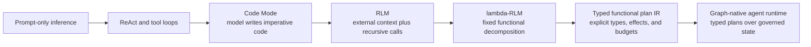
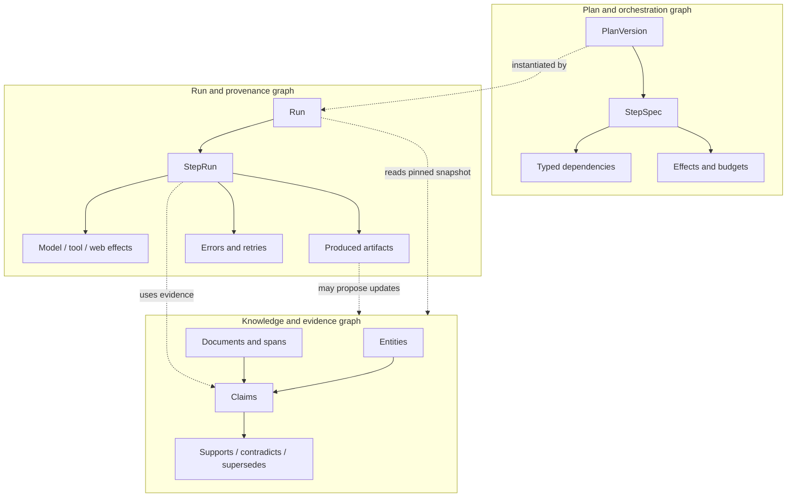
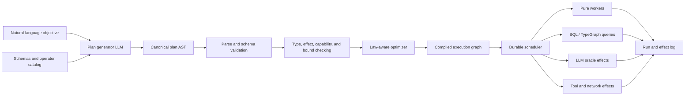
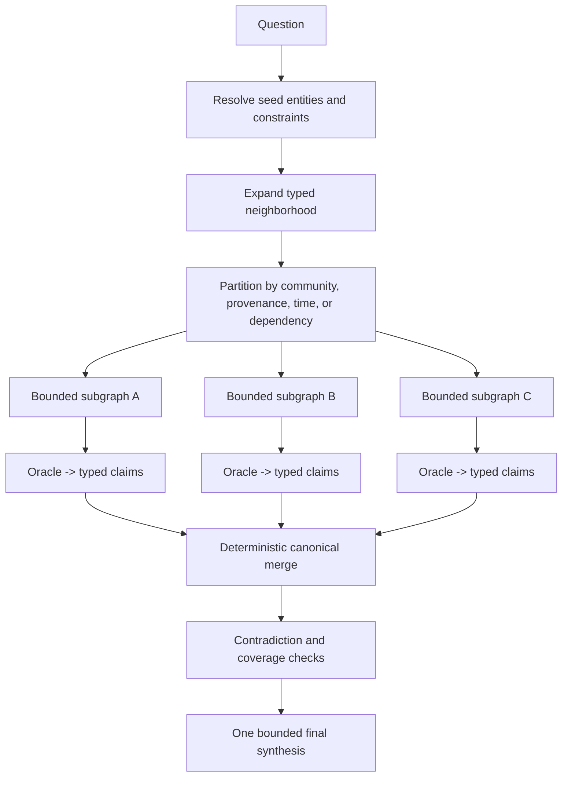
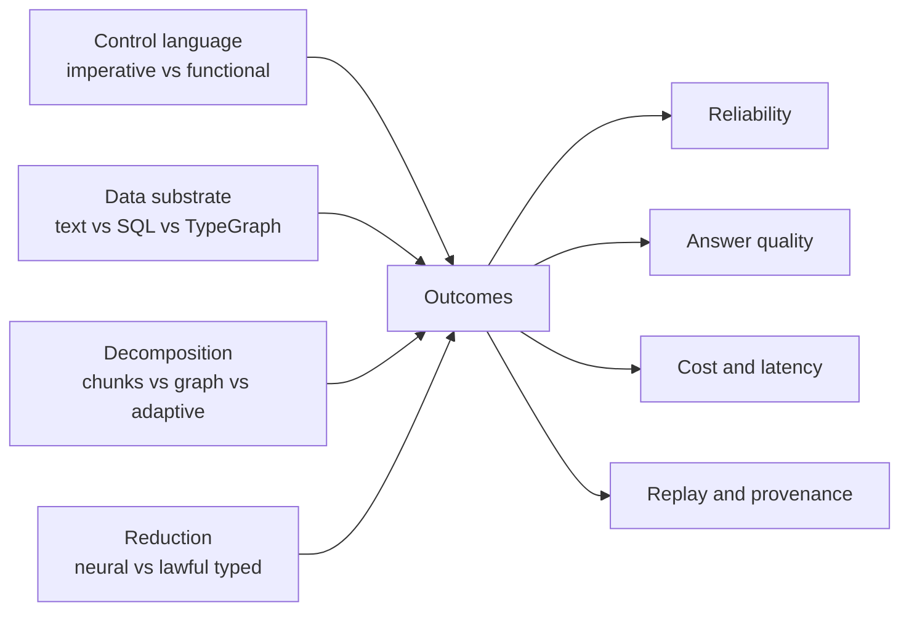

# Functional Graph Programs for Reliable Agents

<!-- markdownlint-disable MD013 MD029 MD060 -->

## A research and implementation proposal spanning RLMs, Code Mode, λ-RLM, functional IRs, and TypeGraph

**Status:** Proposed research program  
**Date:** 2026-07-15  
**Audience:** TypeGraph and agent-runtime engineers, research collaborators, and technical product leadership  
**Decision sought:** Approve a gate-driven proof program—not a general runtime build—to test whether LLM-generated typed functional programs provide a materially better control plane for relational, temporal, and provenance-sensitive agent work.

---

## Executive summary

The idea began with a practical observation about Recursive Language Models (RLMs): their most important contribution is not recursion itself. It is the decision to move an oversized prompt into an external environment and let the model operate on symbolic handles rather than repeatedly stuffing raw context into the model window. Recursion is one strategy for traversing that environment; it is not the essence of the architecture.

Code Mode extends the same principle to tools. Instead of exposing hundreds of tool schemas and asking the model to choose one call per turn, the runtime presents a compact typed API and lets the model write a program that composes calls inside a controlled environment. This reduces context overhead and moves intermediate dataflow out of the model's token stream. But unrestricted imperative code still leaves control flow difficult to predict, statically analyze, optimize, replay, or secure.

λ-RLM sharpens the critique. It replaces RLM's open-ended model-written control loop with a fixed functional decomposition built from operators such as `Split`, `Map`, `Filter`, and `Reduce`. Its reported results are promising: 29 wins across 36 model-task comparisons, with the largest gains for weaker models. Yet the durable contribution is not the Y-combinator. Termination follows from strictly decreasing subproblems, total operators, bounded model calls, and explicit depth—not from unrestricted fixed points. The public implementation is also less pure than the theory: task detection, relevance filters, and several reducers invoke models; the executor is recursive Python; and its type discipline is primarily conventions and annotations rather than a statically checked calculus.

The proposed next step is therefore neither to adopt λ-RLM as the runtime nor to build a universal functional agent language. It is to test a narrower, falsifiable proposition:

> For relational, temporal, and provenance-sensitive work over large external state, can an LLM generate a small typed functional plan more reliably than imperative Code Mode, while a compiler derives useful execution properties before running it and graph-native context selection improves evidence quality over text chunking?

The proposed system has three deliberately separate planes:

1. **Plan and orchestration graph:** a typed, immutable program describing dataflow, branches, bounded recursion, and explicit effects.
2. **Knowledge and evidence graph:** domain entities, claims, artifacts, relationships, time, and provenance used to ground reasoning.
3. **Run and provenance graph:** actual step executions, inputs, outputs, model/tool effects, budgets, errors, and snapshots needed for audit and replay.

The language should be a small JSON AST or S-expression, not generated TypeScript and not arbitrary lambdas. Its default fragment should be applicative: the full execution shape is visible before execution. Selective branching may choose between statically known branches. Dynamic, monadic planning belongs only inside an explicitly budgeted `boundedExplore` node. Recursive control must use `boundedFix` with a well-founded measure, a maximum depth, and hard call/token/time limits. LLMs, tools, network, clocks, randomness, and humans are explicit effects whose results are recorded.

TypeGraph is a promising substrate for schemas, temporal graph reads, recursive traversal, branch/merge, and evidence provenance—but it is not presumed to win. A completed internal benchmark already rejected TypeGraph as the retrieval, claim-ledger, and bounded-impact serving layer for one repository workload: equivalent SQL recursive CTEs matched correctness with less storage and lower directional local latency. That result is a constraint on this proposal. TypeGraph must earn its place on materially different workloads where typed graph semantics, bitemporal reads, semantic merge, or retraction actually affect answer quality or operational guarantees. SQL remains a first-class comparator and may remain the write authority.

The plan progresses through kill gates:

- **Gate 0 — IR generation:** Can models emit valid, type-correct plans across held-out tasks and schemas?
- **Gate 1 — Functional IR vs imperative Code Mode:** Does the IR reduce repairs, runtime failures, budget variance, and capability violations on deterministic tasks?
- **Gate 2 — Static analysis and replay:** Are call bounds, capability checks, cache keys, parallel stages, and exact replay accurate in practice?
- **Gate 3 — Graph-native context:** Does subgraph seeding beat text chunking on multi-hop, temporal, contradiction, and retraction tasks?
- **Gate 4 — TypeGraph-specific value:** Does TypeGraph beat a normalized SQL/event-log implementation on a workload that exercises its differentiated semantics?
- **Gate 5 — Bounded adaptivity:** Does `boundedExplore` recover the quality lost by static plans without recreating open-ended agents?

The result should be retained only if it produces a clear operational reliability win at Gates 0–2 and a workload-specific quality or lifecycle win at Gates 3–4. A beautiful compiler without those wins is not sufficient.

---

## 1. Background and motivation

### 1.1 The underlying problem

Modern agents mix four concerns in one stochastic loop:

- understanding the user's objective;
- deciding what information to inspect;
- controlling tools, branches, loops, and retries;
- interpreting and synthesizing evidence.

When all four are delegated to the language model, failures are hard to localize. A wrong answer may come from bad semantic judgment, a malformed program, an omitted branch, a runaway loop, stale state, a reordered reducer, an external tool failure, or a context-compaction mistake. The system may be impressive while remaining difficult to bound, reproduce, or improve systematically.

The desired architecture does not eliminate model uncertainty. It moves uncertainty to explicit boundaries and turns the rest of the execution into a program that can be inspected before it runs.

### 1.2 The evolution of the idea



Each step moves a different responsibility out of the model's conversational context:

| Stage | What moves out of the prompt | What remains model-controlled |
|---|---|---|
| Direct prompting | Nothing | Content and all implicit control |
| ReAct/tool calling | External operations | Tool selection and stepwise control |
| Code Mode | Tool dataflow and intermediate values | Arbitrary generated program |
| RLM | Oversized context and recursive subcalls | Arbitrary decomposition and control code |
| λ-RLM | Recursive control topology | Leaf reasoning and limited semantic routing |
| Proposed functional IR | Types, effects, budgets, legal control structures | Plan selection plus declared oracle nodes |
| Graph-native runtime | Context selection follows typed relationships, time, and provenance | Semantic planning and bounded adaptive exploration |

### 1.3 The real RLM insight: context as external state

The original RLM formulation stores the prompt in a REPL and gives the model a symbolic handle to it. The model can inspect portions, transform data, and invoke recursive submodels without copying the entire object through every root-model turn. This allows work over inputs far larger than the model's native context window. The paper reports handling inputs up to two orders of magnitude beyond model windows on its evaluated tasks. See [Recursive Language Models](https://arxiv.org/abs/2512.24601).

This can be generalized as:

```text
ordinary inference:  model(prompt)

externalized state:  model(goal, handles, environment)
```

The environment may contain documents, graph records, source spans, intermediate typed values, execution state, cached results, or prior run artifacts. Once context is external, recursion is only one possible control strategy. Others include breadth-first search, best-first search, beam search, work queues, fixed-point evaluation, dependency scheduling, or community-guided descent.

### 1.4 Code Mode: context economy through programmatic composition

Code Mode asks the model to write code against a typed API rather than emitting one tool call per model turn. Intermediate results can flow between calls inside the sandbox, and a progressive discovery surface can avoid loading a large API description into the initial context. Cloudflare reports that this improves composition across large tool surfaces and has since exposed server-side `search()`/`execute()` patterns and sandboxed execution. See [Code Mode: the better way to use MCP](https://blog.cloudflare.com/code-mode/) and [Code Mode: give agents an entire API in 1,000 tokens](https://blog.cloudflare.com/code-mode-mcp/).

This is a strong execution mechanism, but it is not yet a reasoning model. Arbitrary TypeScript or Python can:

- mutate hidden state;
- depend on time, randomness, or network responses implicitly;
- loop without a statically useful bound;
- swallow failures or partially commit writes;
- intermingle data transformation with planning;
- be hard to compare semantically across runs;
- resist safe algebraic rewrites.

The question is not whether models can write code. They can. The question is whether agent control should remain encoded in the most permissive language available.

### 1.5 λ-RLM: structured control over external context

λ-RLM retains prompt-as-environment but replaces the open-ended RLM loop with a pre-built recursive composition. The paper's simplified form is:

```text
fix (fun solve -> fun input ->
  if measure(input) <= threshold
  then oracle(input)
  else reduce(combine, map(solve, split(input))))
```

The paper reports 29 wins out of 36 accuracy comparisons against standard RLM, with weak and medium models benefiting most; standard RLM wins seven cells, especially on CodeQA and with stronger coding models that can exploit adaptive navigation and code-aware chunking. Each reported configuration was run twice, so the evidence is promising rather than definitive. See [λ-RLM](https://arxiv.org/abs/2603.20105), especially its [experimental protocol and results](https://arxiv.org/html/2603.20105#S5).

The central lesson is valuable:

> Separate neural semantic work from symbolic structural control.

But a literal Y-combinator interface is not the right product abstraction, and the present implementation should be treated as a research baseline rather than the production substrate.

### 1.6 Functional IR: from generated code to generated plans

The next step is to have the model generate a restricted program representation:

```json
{
  "op": "fold",
  "source": {
    "op": "map",
    "source": {
      "op": "graphQuery",
      "query": "open_decisions_for_repository"
    },
    "body": {
      "op": "oracle",
      "prompt": "extract_decision_claims",
      "output": "Claim[]"
    }
  },
  "reducer": "claim_union"
}
```

The model selects legal operators and fills typed arguments. It does not define arbitrary loops or smuggle code into strings. The plan can be parsed, type-checked, budgeted, linted, optimized, displayed, cached, and replayed before any expensive effect runs.

This resembles a database query planner more than a general-purpose language runtime. The model describes *what computation is needed*; the compiler decides how to lower, schedule, batch, cache, and execute it.

### 1.7 Why TypeGraph enters the picture

TypeGraph already provides several ingredients relevant to this experiment:

- Zod-backed schemas and inferred TypeScript types;
- a query AST that compiles graph traversals to SQL;
- recursive CTE-backed traversal and graph algorithms;
- valid-time and recorded-time views;
- branch/merge with deterministic conflict reporting and provenance;
- provenance retraction with historical replay;
- schema introspection and validation.

These features make TypeGraph a plausible typed state substrate for graph-grounded plans. They do **not** make it the orchestrator, durable workflow engine, policy layer, or automatic winner over SQL. The proposed runtime sits above TypeGraph and can target other backends.

---

## 2. Critical assessment of the precursor systems

### 2.1 RLM

#### What RLM gets right

- Externalizing context removes the native context window as the sole memory boundary.
- Symbolic handles avoid copying large values through every model turn.
- Programmatic subcalls allow batch decomposition and aggregation.
- The model can discover an execution strategy while inspecting the actual data.
- The same abstraction can cover documents, repositories, tables, or other external objects.

#### Where RLM remains weak

- The control loop is model-authored and open-ended.
- Parse, runtime, and reference errors are independent of reasoning quality.
- Call count and cost are difficult to predict tightly.
- Dynamic recursion may repeat work or omit regions without coverage accounting.
- The runtime sees arbitrary code rather than a semantic plan, limiting optimization.
- Exact replay requires recording all effects and code-visible environmental state.
- Smaller models pay a high "coding tax" before solving the underlying task.

RLM should therefore be understood as evidence for **externalized programmable context**, not as proof that unrestricted recursive Python is the best control representation.

### 2.2 Code Mode

#### What Code Mode gets right

- It compresses large tool surfaces into a conventional API.
- It keeps intermediate dataflow inside a sandbox rather than round-tripping through the model.
- It exploits models' broad exposure to ordinary programming languages.
- It can compose many calls in one model-authored action.
- A controlled executor can mediate credentials, timeouts, and network capabilities.

#### Where Code Mode remains weak

- General-purpose code is too expressive for static orchestration guarantees.
- Hidden side effects make caching and replay unsafe by default.
- Equivalent programs are difficult to recognize or optimize.
- Imperative ordering may serialize work that could run in parallel.
- Fine-grained capability review often happens only at runtime.
- A sandbox contains damage; it does not make the program semantically analyzable.
- Reliable writes still require transaction, idempotency, and compensation semantics above the sandbox.

Code Mode is best treated as an **execution backend** or escape hatch, not necessarily the highest-level plan language.

#### Internal Code Mode/RLM proof already completed

An internal Cloudflare-based prototype has already validated the combined
mechanism on a large real corpus. It placed the TypeScript compiler corpus
(approximately 2.3 million tokens) behind a bounded context connector and ran
one durable object per recursive node. The direct context-stuffing baseline
failed with a real prompt-too-long rejection. The RLM treatment completed 25
nodes to depth three in roughly 5.2 minutes, paused for human approval, survived
a kill/restart during that pause, and returned a cited answer that corrected an
earlier naming guess after inspecting source.

The same run exposed the most relevant weakness for this proposal: the model
invented invalid `ContextRef` shapes, creating silent empty scopes and wasted
work. That is exactly the failure a closed, typed plan vocabulary should make
structurally impossible. The experiment should therefore be treated as proof
that durable Code Mode plus externalized recursive context works, while leaving
plan validity and decomposition quality open. Source:
`/Users/paul/orgs/nicia/nicia.ai/context/ideas/experiments/2026-07-02-rlm-codemode-demo.md`.

### 2.3 λ-RLM

#### What λ-RLM gets right

- It makes the control topology explicit.
- It confines model use to bounded semantic operations in the theoretical model.
- It demonstrates that restricted composition can substitute for coding ability on some tasks.
- It enables pre-execution reasoning about depth and cost under stated assumptions.
- It highlights the value of separating content reasoning from orchestration.

#### Claims that need narrower wording

| Broad claim | More defensible interpretation |
|---|---|
| The Y-combinator guarantees termination | General fixed points permit nontermination. Termination follows from a strictly decreasing measure, total combinators, and bounded oracle calls. |
| Neural inference occurs only at leaves | True in the clean abstraction, but the public implementation uses a model for task classification, relevance filtering, and several reducers. |
| The runtime is typed | The paper presents typed signatures, but the public executor is recursive Python with annotations and conventions, not a statically checked λ-term language. |
| Combinators are deterministic | Conditional on implementations and effects. Neural reducers, provider failures, retries, and malformed outputs break literal determinism. |
| Cost is known exactly | Structural call bounds can be known; dollar cost, output tokens, retries, queueing, and provider latency still require distributions or caps. |
| The partition is optimal | Optimal under a simplified cost/accuracy model, not under arbitrary task topology, rate limits, variable outputs, graph structure, or adaptive search. |
| Repeatable agents result automatically | The execution shape may repeat. Exact replay requires persisted effect results; semantic correctness still requires workload-specific evaluation. |

The paper itself states the relevant assumptions: model calls halt in bounded time; every combinator is total and deterministic; cost is monotone; and accuracy/composition behave according to the assumed model. Its termination proof uses a strictly shrinking split and counts leaf model calls plus one task-detection call. See the [theoretical guarantees](https://arxiv.org/html/2603.20105#S4).

#### Public implementation observations

As inspected at commit `3874d393483dc4299101918cf8e9af670194bd88`:

- `LambdaRLM` builds and executes a recursive Python function rather than evaluating a typed λ-term.
- Task detection is a model call.
- QA/extraction relevance filtering makes one neural decision per candidate chunk.
- summary, QA, and analysis reducers can invoke the model at internal nodes.
- planning uses character-length thresholds with simplified relative costs and fixed accuracy parameters.
- no dedicated test directory exists in the repository at that commit.
- the repository has 27 commits and no tagged release at that snapshot.

The implementation is useful as a benchmark and source of task templates. It should not define the production abstraction.

### 2.4 Functional IR does not automatically solve semantics

A typed plan can prove that a value is a `Claim[]`; it cannot prove that the claims are true. A bounded loop can prove a maximum of five iterations; it cannot prove that the search policy will find the relevant evidence. A pure reducer can ensure stable ordering; it cannot make incompatible assertions compatible.

The proposal separates three kinds of assurance:

1. **Structural assurance:** the plan is well-typed, capability-safe, and bounded.
2. **Execution assurance:** effects are recorded, retries are governed, and replay is exact.
3. **Semantic assurance:** answers are correct, complete, and supported on the target workload.

The first two can be engineered. The third must be measured.

---

## 3. Thesis, goals, and non-goals

### 3.1 Thesis

The proposed thesis has two independent parts:

1. **Control-language thesis:** an LLM-generated typed functional IR is easier to generate correctly and easier for a runtime to reason about than arbitrary imperative Code Mode.
2. **Graph-decomposition thesis:** for graph-shaped tasks, seeding bounded oracle contexts from typed subgraphs is more effective than seeding them from arbitrary text chunks.

These must be evaluated separately. A system can validate one and falsify the other.

### 3.2 Goals

- Raise first-attempt plan validity and execution success.
- Derive useful properties before execution: effect set, call bounds, capability set, parallel stages, cacheability, and termination evidence.
- Make nondeterminism explicit and recordable.
- Support exact replay from persisted effects and pinned data snapshots.
- Compile deterministic work into efficient backend operations.
- Seed model calls with semantically coherent, bounded contexts.
- Preserve evidence provenance through deterministic intermediate records.
- Allow bounded adaptivity without returning to an unrestricted agent loop.
- Establish falsifiable criteria for when TypeGraph contributes value beyond SQL.

### 3.3 Non-goals for the first program

- A general-purpose programming language.
- A replacement for Python, TypeScript, or shell in all agent tasks.
- A proof that functional programs are superior for every agent.
- A visual workflow product.
- A new durable workflow engine.
- An unrestricted theorem-proving or proof-carrying agent system.
- A requirement that TypeGraph own the authoritative write path.
- Automatic schema mutation by model-generated plans.
- Production deployment before the benchmark gates pass.

### 3.4 Strongest falsifiable claim

> On relational, temporal, and provenance-sensitive tasks over large external state, LLM-generated typed functional plans execute more reliably and predictably than imperative Code Mode; when graph structure is genuinely task-relevant, graph-seeded bounded reasoning produces better-supported answers than text-chunk decomposition at comparable or lower total work.

---

## 4. What repeatability means

"Repeatable" is not one property.

| Level | Definition | Mechanism |
|---|---|---|
| Structural repeatability | Same plan topology, legal branches, and declared bounds | Immutable typed plan and deterministic compiler |
| State repeatability | Same graph/documents/policies are visible | Pinned snapshot, content-addressed artifacts, recorded-time read |
| Execution replay | Same external results are reused | Effect log with model/tool/web/clock/random outputs |
| Schedule independence | Parallel ordering does not affect output | Lawful reducers, stable ordering, idempotent effects |
| Semantic stability | Correct answer and evidence remain consistent | Task-specific evaluations and repeated trials |

Temperature zero is not exact replay. Provider implementations can change; tool and web results can drift; database state may advance; retries may produce different results. Temporal's durable-execution model is the clearest precedent: workflow logic must be deterministic, while external activities are recorded and their prior results are reused during replay. See [Temporal workflow definitions](https://docs.temporal.io/workflow-definition) and [Temporal workflows](https://docs.temporal.io/workflows).

---

## 5. Architecture: three graphs, three semantics

The design must keep orchestration, knowledge, and execution provenance distinct even if all three are stored in one physical database.



### 5.1 Plan and orchestration graph

Contains:

- immutable plan versions;
- operator nodes and typed ports;
- static branches and bounded fixed points;
- effect and capability declarations;
- budget upper bounds;
- optimizer decisions and compiled execution graph.

Its semantics are those of a program. A dependency edge means "must produce a value before this consumer can run," not "is related to."

### 5.2 Knowledge and evidence graph

Contains:

- entities, artifacts, claims, observations, policies, and decisions;
- relationships among them;
- valid time and recorded time;
- source lineage, support, contradiction, supersession, and retraction.

Its semantics are domain-level. A `SUPPORTS` edge expresses an evidentiary relationship, not an execution dependency.

### 5.3 Run and provenance graph

Contains:

- the concrete execution of a plan;
- every step attempt and final status;
- resolved input and output artifact hashes;
- effect requests and recorded results;
- model/provider/configuration metadata;
- graph snapshot or SQL revision used;
- call, token, latency, and cost measurements;
- validation failures, retries, approvals, and cancellation.

Its semantics are historical and operational. It answers "what happened and why?"

### 5.4 Why the separation matters

If the three meanings are collapsed:

- changing a knowledge relationship can accidentally alter scheduling;
- a speculative thought may be mistaken for a domain fact;
- a retry edge may look like business provenance;
- replay cannot distinguish the plan from one historical execution;
- access policies become ambiguous.

They may share stable identifiers and cross-links, but they require separate schemas and invariants.

---

## 6. Proposed compiler and runtime



### 6.1 Plan generation

The model receives:

- the objective;
- a compact data/schema catalog;
- operator signatures;
- capability grants;
- a budget envelope;
- a small set of registered functions, predicates, reducers, and prompt templates.

It returns only a structured plan. The first implementation should use strict structured output into a JSON AST. The model must not emit source code inside plan fields.

### 6.2 Validation and elaboration

Validation occurs in layers:

1. JSON/schema validation.
2. Identifier resolution against the registered catalog.
3. Input/output type unification.
4. Effect-set inference.
5. Capability inclusion check.
6. Termination and bound check.
7. Reducer-law requirements.
8. Backend capability check.
9. Budget feasibility estimation.

Errors should be structured and locally repairable:

```json
{
  "code": "TYPE_MISMATCH",
  "path": ["steps", 4, "body"],
  "expected": "Claim[]",
  "actual": "EvidenceRef[]",
  "suggestions": ["insert registered function evidence_to_claims"]
}
```

### 6.3 Optimization

Only semantics-preserving rewrites are legal. Candidate rewrites include:

```text
map(f, map(g, xs))                 -> map(compose(f, g), xs)
filter(p, graphQuery(q))           -> graphQuery(pushDown(q, p))
map(oracleA, xs) + map(oracleB,xs) -> map(batch(A, B), xs)
distinct(distinct(xs))             -> distinct(xs)
fold(m, concat(xs, ys))            -> combine(fold(m,xs), fold(m,ys))
```

The last rewrite requires an associative reducer with an identity. Reordering requires commutativity. Retry deduplication requires idempotence. No rewrite may cross an uncontrolled effect boundary.

### 6.4 Execution

The execution engine resolves the compiled graph into stages:

- deterministic queries and pure transforms;
- parallel independent branches;
- bounded oracle batches;
- explicit checkpoints;
- governed retries;
- approval gates;
- final deterministic materialization or bounded synthesis.

The first prototype should reuse an existing queue/workflow substrate where practical. The research contribution is the plan semantics, compiler, and evaluation—not rebuilding durable scheduling from first principles.

### 6.5 Interpreters

The same plan should support multiple interpreters:

- **validate:** return types, effects, capabilities, and errors;
- **estimate:** calculate predicted calls/tokens/cost/critical path;
- **dry-run:** resolve queries and show intended effects without executing them;
- **live:** execute effects and record results;
- **replay:** reuse recorded effect results;
- **mock:** replace oracles/tools with fixtures;
- **explain:** render a human-readable plan;
- **diff:** compare plan versions and changed effect surfaces.

---

## 7. Typed operator algebra

### 7.1 Design principles

The algebra should be:

- small enough for reliable model generation;
- closed over typed values rather than source-code lambdas;
- explicit about effects and failures;
- statically budgetable wherever possible;
- deterministic by default;
- extensible through registered operators rather than arbitrary code injection;
- serializable and content-addressable;
- backend-neutral at the plan level.

### 7.2 Core judgments

Use a type-and-effect judgment of the form:

```text
Catalog; Capabilities |- Plan : Input -> Output ! Effects [Bound]
```

Where:

- `Input` and `Output` are schema references;
- `Effects` is a finite set such as `{graph.read, llm}`;
- `Bound` contains maximum calls, input/output tokens, depth, rows, wall time, and concurrency;
- the plan is valid only if inferred effects are a subset of granted capabilities.

### 7.3 Core value types

- primitives: `String`, `Number`, `Boolean`, `Timestamp`, `Duration`;
- schema values: `Entity<K>`, `Edge<K>`, `Claim`, `EvidenceRef`, `ArtifactRef`;
- collections: `List<T>`, `Set<T>`, `Map<K,V>`, `Option<T>`;
- results: `Result<T,E>`;
- temporal handles: `SnapshotRef`, `RecordedInstant`, `ValidInterval`;
- plan handles: `PlanRef<I,O,E>`;
- effect handles: `EffectRef<T>`;

Collections must have stable ordering rules whenever order can affect downstream behavior.

### 7.4 Operator catalog

#### Pure dataflow

| Operator | Signature | Notes |
|---|---|---|
| `pure` | `A -> Plan<A>` | Embed validated constant |
| `project` | `(A, FieldSet) -> B` | Registered projection only |
| `map` | `(List<A>, Fn<A,B>) -> List<B>` | Parallelizable if body effects permit |
| `flatMap` | `(List<A>, Fn<A,List<B>>) -> List<B>` | Requires output bound |
| `filter` | `(List<A>, Predicate<A>) -> List<A>` | Predicate must be registered |
| `join` | `(List<A>, List<B>, KeyFns) -> List<C>` | Declared cardinality/bound |
| `groupBy` | `(List<A>, KeyFn<A,K>) -> Map<K,List<A>>` | Stable key ordering |
| `sort` | `(List<A>, Ordering<A>) -> List<A>` | Explicit total ordering |
| `take` | `(List<A>, Nat) -> List<A>` | Useful budget boundary |
| `union` | `(List<A>, List<A>) -> List<A>` | Multiset unless paired with `distinct` |
| `distinct` | `(List<A>, KeyFn<A,K>) -> List<A>` | Canonical representative rule required |
| `fold` | `(List<A>, Reducer<A,B>, Identity<B>) -> B` | Laws drive parallelization |

#### Data access

| Operator | Signature | Effect |
|---|---|---|
| `graphQuery` | `QueryRef<I,O> x I x SnapshotRef -> O` | `graph.read` |
| `traverse` | `Seeds x TraversalSpec x SnapshotRef -> Subgraph` | `graph.read` |
| `search` | `SearchSpec x SnapshotRef -> EvidenceRef[]` | `search.read` |
| `readArtifact` | `ArtifactRef -> Bytes or Text` | `artifact.read` |
| `sqlQuery` | `PreparedQueryRef<I,O> x I x SnapshotRef -> O` | `sql.read` |

Queries are registered ASTs or prepared templates. Model-authored raw SQL is outside the initial language.

#### Neural and external effects

| Operator | Signature | Effect |
|---|---|---|
| `oracle` | `PromptRef x A x OutputSchema -> B` | `llm` |
| `tool` | `ToolRef<I,O> x I -> O` | declared tool capability |
| `human` | `ApprovalSpec<A> -> A` | `human` |
| `clock` | `Unit -> Timestamp` | `clock` |
| `random` | `Distribution<A> -> A` | `random` |

All return recorded results in live mode and prior results in replay mode.

#### Control

| Operator | Purpose | Constraint |
|---|---|---|
| `select` | Choose between statically known branches | condition typed as `Boolean` or tagged union |
| `attempt` | Execute with typed failure handling | retry policy explicit |
| `checkpoint` | Persist a named value and continuation boundary | value serializable |
| `boundedFix` | Recursive decomposition | decreasing measure plus hard maxima |
| `boundedExplore` | Dynamic next-step planning | bounded policy, finite capability set, recovery result |
| `parallel` | Assert independent branches | effect-conflict check |

### 7.5 Illustrative plan representation

```ts
type Effects = readonly EffectName[];

type Budget = Readonly<{
  maxCalls: number;
  maxInputTokens: number;
  maxOutputTokens: number;
  maxWallMs: number;
  maxConcurrency: number;
}>;

type Plan =
  | {
      op: "pure";
      value: JsonValue;
      output: SchemaRef;
    }
  | {
      op: "graphQuery";
      query: QueryRef;
      args: Plan;
      snapshot: SnapshotRef;
      output: SchemaRef;
      effects: readonly ["graph.read"];
    }
  | {
      op: "oracle";
      prompt: PromptRef;
      input: Plan;
      output: SchemaRef;
      effects: readonly ["llm"];
      budget: Budget;
    }
  | {
      op: "map";
      source: Plan;
      body: FunctionRef;
      maxItems: number;
      parallelism: number;
    }
  | {
      op: "fold";
      source: Plan;
      reducer: ReducerRef;
      identity: JsonValue;
    }
  | {
      op: "select";
      condition: Plan;
      whenTrue: Plan;
      whenFalse: Plan;
    }
  | {
      op: "boundedFix";
      seed: Plan;
      body: FunctionRef;
      measure: MeasureRef;
      maxDepth: number;
      budget: Budget;
      onNoProgress: Plan;
    }
  | {
      op: "boundedExplore";
      seed: Plan;
      policy: PolicyRef;
      allowedOps: readonly OperatorName[];
      maxSteps: number;
      budget: Budget;
      onExhausted: Plan;
    };
```

### 7.6 Why arbitrary lambdas are excluded initially

If the model may define arbitrary functions inside `map`, `filter`, or `fold`, the system recreates Code Mode in a less familiar syntax. The first language should instead reference registered functions with known types, effects, complexity, and version hashes.

User-defined functions can be introduced later through a separate review and compilation path, never as unchecked strings inside a plan.

### 7.7 Functional hierarchy of expressiveness

The plan language should deliberately stratify expressiveness:

1. **Applicative fragment:** full dependency graph is known before execution. Best for costing, parallelism, caching, and audit. Default.
2. **Selective fragment:** condition chooses among branches that are both statically present. Useful for typed routing without arbitrary plan growth.
3. **Bounded dynamic fragment:** next step depends on prior model/tool output. Confined to `boundedExplore`, with finite capabilities and hard limits.

This provides a principled answer to the workflow-versus-agent debate: use the least expressive fragment that can solve the task.

### 7.8 Bounded recursion

`boundedFix` must require:

- a well-founded measure such as remaining records, unresolved claim count, remaining depth, or unvisited partition count;
- a runtime assertion that recursive children decrease the measure;
- maximum depth and total node count;
- call, token, wall-time, and concurrency limits;
- cycle handling for graph values;
- an explicit `onNoProgress` recovery result.

Example:

```json
{
  "op": "boundedFix",
  "measure": "unresolved_claim_count",
  "maxDepth": 4,
  "budget": {
    "maxCalls": 24,
    "maxInputTokens": 180000,
    "maxOutputTokens": 24000,
    "maxWallMs": 120000,
    "maxConcurrency": 6
  },
  "onNoProgress": { "op": "pure", "value": { "status": "incomplete" } }
}
```

For monotone graph closure, use a least-fixed-point/recursive-query operator rather than general recursion. Datalog's monotone least-fixed-point semantics is a better model for reachability, transitive implications, and recursive policy evaluation. Research on semiring Datalog extends this to counts, costs, and provenance. See [Convergence of Datalog over (Pre-)Semirings](https://arxiv.org/abs/2105.14435).

### 7.9 Reducer laws

An LLM merge is generally not associative, commutative, or idempotent:

```text
merge(merge(a,b),c) != merge(a,merge(b,c))
```

Different reduction trees, retry orders, and parallel schedules can therefore produce different answers. The preferred pattern is:

1. leaf oracles emit typed records;
2. deterministic code validates and canonicalizes them;
3. a lawful reducer deduplicates and groups them;
4. one final bounded oracle synthesizes prose from canonical data.

Reducers should carry machine-checked metadata:

```ts
type ReducerLaws = Readonly<{
  associative: boolean;
  commutative: boolean;
  idempotent: boolean;
  hasIdentity: boolean;
}>;
```

Declarations are not enough. Property tests should exercise the laws over generated values before a reducer is admitted to optimization.

---

## 8. Relationship to TypeGraph

### 8.1 Layering decision

TypeGraph is a candidate typed knowledge substrate and query compiler. It is not the plan compiler, sandbox, durable scheduler, or governance product.

```text
agent plan compiler and runtime
  ├─ capability and budget policy
  ├─ durable execution and effect log
  ├─ oracle/tool adapters
  └─ data backends
       ├─ TypeGraph
       ├─ normalized SQL/event log
       ├─ document/artifact store
       └─ external systems
```

This boundary keeps the experiment honest. If a SQL query is simpler and faster, the plan may target SQL directly. If TypeGraph's temporal, merge, or provenance semantics create value, that value can be measured without making TypeGraph the orchestrator.

### 8.2 Capabilities TypeGraph already contributes

At repository commit `e4ed8e53dc78f97c68438ac060a11c217feb724f`, the documented surface includes:

- Zod-defined node and edge schemas with TypeScript inference;
- typed query and traversal APIs compiled to SQLite or PostgreSQL;
- `shortestPath`, `reachable`, `canReach`, `neighbors`, and `degree` algorithms;
- valid-time reads and opt-in recorded-time reconstruction through `asOfRecorded`;
- graph branch/merge with deterministic resolution, conflict reports, edge repointing, and provenance;
- provenance retraction that preserves alternate support and permits before/after replay.

These features map to the proposed runtime as follows:

| Runtime need | TypeGraph role |
|---|---|
| Typed external state | Schema-driven entities and edges |
| Registered data functions | Query ASTs, traversals, graph algorithms |
| Snapshot pinning | Valid-time and recorded-time views |
| Parallel extraction branches | Isolated graph branches |
| Canonicalization | Deterministic graph merge and entity resolution |
| Evidence lifecycle | Support, provenance, and retraction models |
| Context construction | Typed subgraphs and relationship paths |

### 8.3 What TypeGraph does not provide by itself

- exact replay of LLM, web, or external API outputs;
- a deterministic workflow event history;
- model/tool capability enforcement;
- sandboxed code execution;
- prompt/template versioning;
- global cost and token budgets;
- a typed agent-plan language;
- human approval or policy semantics;
- semantic correctness of model-produced claims.

Those remain runtime or application responsibilities.

### 8.4 Prior negative evidence is a design constraint

The internal `typegraph-rlm-bench` already tested a concrete TypeGraph/RLM architecture across retrieval, claim-ledger, projection, and bounded serving gates. The final bounded-impact comparison found:

| Measure | SQL recursive CTE | TypeGraph |
|---|---:|---:|
| Frozen answers correct | 4/4 | 4/4 |
| Foreign-scope rejection | yes | yes |
| Deterministic replay | yes | yes |
| Database bytes | 69,632 | 237,568 |
| Directional median local query | 0.052 ms | 0.617 ms |

The report explicitly warns that the timing is directional and the workload small. The architectural conclusion still stands: TypeGraph provided no material serving advantage there, so the projection was removed. Source: `/Users/paul/orgs/nicia/typegraph-rlm-bench/docs/impact-serving-v1.md`.

The new program must not rerun the same hypothesis under a different label. It needs workloads in which one of the following is causally relevant:

- bitemporal reconstruction changes the correct answer;
- provenance retraction changes which claims remain supported;
- semantic branch/merge resolves parallel model-produced graph state;
- graph-native decomposition changes coverage, contradiction handling, or incremental recomputation;
- typed plan generation itself is the treatment, independent of storage.

### 8.5 Authority and projection options

Three deployment topologies should remain available:

1. **TypeGraph authority:** TypeGraph owns domain writes and temporal/provenance state.
2. **SQL/event-log authority with disposable TypeGraph projection:** useful only if a serving workload passes a separate value gate.
3. **SQL-only:** plan compiler targets prepared SQL and retains graph semantics at the application layer.

The benchmark should choose based on evidence, not architectural preference.

---

## 9. Graph-native decomposition

### 9.1 From text partitions to semantic partitions

Text RLM commonly splits by character range, token count, document, or file. These are storage boundaries, not necessarily reasoning boundaries.

A graph can decompose by:

- connected component;
- community or hierarchical community;
- entity neighborhood;
- dependency direction;
- provenance source or source family;
- temporal interval or change lineage;
- strongly connected component;
- claim family;
- policy scope;
- unresolved contradiction cluster.



### 9.2 Community structure as a candidate recursion tree

A hierarchical community index can provide a data-derived decomposition:

- parent nodes see community summaries;
- relevant communities are selected for descent;
- child scopes are enumerated and validated;
- hubs are retained at the parent or replicated as join keys;
- coverage and duplication are measurable;
- stable communities may support incremental re-answering.

This is related to GraphRAG, which builds an entity graph, detects hierarchical communities, pre-generates community summaries, maps a global question over them, and reduces partial responses. See [From Local to Global: A Graph RAG Approach to Query-Focused Summarization](https://www.microsoft.com/en-us/research/publication/from-local-to-global-a-graph-rag-approach-to-query-focused-summarization/). The proposed distinction is adaptive, typed descent with explicit budgets and provenance-preserving outputs rather than an unconditional prose map-reduce.

Community decomposition is a hypothesis, not a universal rule. Cross-cutting questions may align poorly with communities. The plan needs a residual partition, hub handling, and an escape route to broader search.

### 9.3 Context packs for oracle calls

An oracle should receive a bounded, typed context pack rather than an unstructured concatenation:

```ts
type OracleContextPack = Readonly<{
  objective: string;
  snapshot: SnapshotRef;
  entities: readonly EntityRef[];
  claims: readonly Claim[];
  evidence: readonly EvidenceExcerpt[];
  paths: readonly RelationshipPath[];
  temporalLens?: ValidInterval | RecordedInstant;
  provenancePolicy: ProvenancePolicyRef;
  outputSchema: SchemaRef;
  coverage: Readonly<{
    partitionId: string;
    includedMembers: number;
    totalMembers: number;
    residualRefs: readonly string[];
  }>;
}>;
```

Every evidence excerpt should have a host-issued, content-addressed handle. The model selects handles; it does not invent file paths or source ranges.

### 9.4 Graph-aware recursion over cycles

Graphs are not trees. The runtime must distinguish:

- traversal cycles, handled by visited sets or bounded hop semantics;
- strongly connected components, which may be collapsed into supernodes;
- recursive plans, controlled by `boundedFix`;
- monotone closure, evaluated through least fixed points;
- mutable feedback loops, allowed only through explicit bounded exploration.

This prevents the word "recursion" from obscuring several different computational problems.

### 9.5 Relevant functional graph research

Several older research lineages are more directly useful than the Y-combinator branding:

- **Term graphs and interaction nets:** lambda terms represented as graphs enable sharing and local graph reduction. Agent relevance: common-subplan elimination and avoiding duplicate oracle calls.
- **UnCAL/UnQL:** structural recursion over graph-shaped and cyclic data provides an algebra for graph transformation. Agent relevance: lawful graph folds and compositional transformations. See [The Algebra of Recursive Graph Transformation Language UnCAL](https://arxiv.org/abs/1511.08851).
- **Algebraic graphs:** graphs as compositional functional values support equational reasoning and avoid malformed internal representations. See [Algebraic Graphs with Class](https://eprints.ncl.ac.uk/239461).
- **Datalog and semiring fixed points:** monotone recursive evaluation supports reachability, path costs, counts, and provenance.
- **Agent calculi:** `λ_A` adds typed oracle calls, bounded fixpoints, probabilistic choice, and mutable environments; LLMbda models conversations and dynamic information-flow control. Both are early research, but their bounded fixpoints, lint rules, capabilities, and isolation ideas are more relevant to general agent composition than unrestricted λ-calculus. See [`λ_A`](https://arxiv.org/abs/2604.11767) and [The LLMbda Calculus](https://arxiv.org/abs/2602.20064).

### 9.6 Adjacent research and industry direction

The broader field is converging on structured programs and explicit execution
graphs without converging on literal lambda-calculus interfaces:

- **LMQL** combines prompting with scripting and output constraints, then
  compiles the program into an inference procedure. It demonstrates that a
  language can expose model-specific semantics and optimize underneath a
  higher-level program. See [Prompting Is Programming](https://arxiv.org/abs/2212.06094).
- **DSPy** represents language-model applications as text-transformation graphs
  with declarative modules and compiler-driven optimization. Its focus is
  learning prompts and demonstrations rather than proving execution bounds, but
  it establishes the usefulness of a compiler boundary. See
  [DSPy](https://arxiv.org/abs/2310.03714).
- **LLMCompiler** turns planned function calls into a dependency graph and
  schedules independent work in parallel. The published evaluation reports
  latency and cost benefits over sequential ReAct, supporting the value of
  separating planning from scheduling. See
  [An LLM Compiler for Parallel Function Calling](https://arxiv.org/abs/2312.04511).
- **LangGraph** exposes graph/state-machine orchestration with checkpoints,
  fault tolerance, human interruption, and time travel. Its docs distinguish
  thread-scoped checkpoints from cross-thread stores, a useful precedent for
  separating run state from knowledge state. See
  [LangGraph persistence](https://docs.langchain.com/oss/python/langgraph/persistence).
- **Temporal** provides the stronger replay model relevant here: deterministic
  workflow decisions are checked against event history, while external
  activities—including LLM calls—have recorded results reused during replay.
  It is the industrial baseline against which any new durability claim should
  be judged.
- **GraphRAG** demonstrates that hierarchical community structure and summaries
  can improve global corpus questions, while also making the graph-indexing
  cost explicit. It is the closest established comparator for community-guided
  context construction.

The open gap is not another visual agent graph. It is a small model-generable
plan language with static types, explicit effects and budgets, lawful
optimization, exact effect replay, and a first-class link from execution steps
to temporal evidence. That is the specific contribution this proposal should
test.

---

## 10. Research hypotheses

### H1 — Models generate the functional IR more reliably than imperative code

Compared with Python or TypeScript Code Mode on the same deterministic tasks, the IR will show:

- higher parse success;
- higher first-pass type validity;
- fewer repair turns;
- fewer runtime exceptions;
- fewer capability violations;
- fewer unbounded or budget-exceeding executions;
- lower variance in calls, tokens, and latency.

**Initial target:** at least 95% syntactic validity, 90% type validity without repair, 85% first-execution success, and at least 2x fewer repair turns than imperative Code Mode.

### H2 — The runtime can derive accurate properties before execution

For accepted plans, the compiler will predict or bound:

- LLM/tool call count;
- maximum input/output tokens;
- required capabilities;
- recursion depth and termination evidence;
- parallel stages and critical path;
- cacheable nodes;
- data snapshots and effect surfaces.

**Initial target:** no undeclared effects; 100% of executions remain within structural hard bounds; estimated non-retry call count equals actual count for the static fragment.

### H3 — Law-aware optimization creates measurable value

Safe batching, predicate pushdown, common-subexpression elimination, and parallel scheduling will reduce latency or cost without changing canonical outputs.

**Initial target:** at least 20% median critical-path reduction on a task set containing genuine independent work, with byte-identical deterministic intermediate outputs.

### H4 — Typed records plus deterministic reduction beat neural intermediate merging

Leaf oracles that emit canonical claims/evidence followed by deterministic merge will show:

- lower answer and citation variance;
- fewer unsupported claims;
- better contradiction preservation;
- safer retry behavior;
- lower internal-node prompt volume.

### H5 — Graph-native decomposition beats text decomposition on graph-shaped tasks

Holding plan language, model, budget, and reducer constant, subgraph context will improve:

- multi-hop recall;
- temporal correctness;
- citation completeness;
- contradiction/retraction handling;
- work scaling as the corpus grows.

This is expected only on tasks whose dependency structure is genuinely represented in the graph.

### H6 — TypeGraph adds value only when its semantics are exercised

Holding plan and data constant, TypeGraph should be retained only if bitemporal reads, provenance retraction, or semantic branch/merge produce a quality, audit, or lifecycle advantage over normalized SQL/event-log implementations that justifies their cost.

### H7 — Bounded adaptivity recovers hard-task quality without open-ended control

On tasks where the static plan fails due to missing information or unexpected topology, `boundedExplore` will improve quality while preserving hard budgets and explicit effects.

**Guardrail:** if dynamic planning becomes the common path, the static language is too weak or the task selection is wrong.

---

## 11. Benchmark design

### 11.1 Experimental discipline

The benchmark must isolate four variables:

1. **Control language:** imperative code vs typed functional IR.
2. **Data substrate:** text/artifacts vs normalized SQL vs TypeGraph.
3. **Decomposition policy:** fixed chunks vs document/file vs graph neighborhood/community vs bounded adaptive.
4. **Reduction policy:** neural intermediate merge vs typed deterministic merge plus final synthesis.

Changing all four at once would produce a demo, not evidence.

### 11.2 Core systems under comparison

| ID | System | Purpose |
|---|---|---|
| A | Direct long-context model | Single-call baseline |
| B | Retrieval plus synthesis | Conventional RAG baseline |
| C | Imperative Code Mode | Tests generated-code reliability |
| D | Standard text RLM | Tests open-ended recursive control |
| E | λ-RLM repository | Published structured-recursion baseline |
| F | Functional IR over text/artifacts | Isolates control-language value |
| G | Functional IR over normalized SQL graph tables | Isolates graph semantics without TypeGraph |
| H | Functional IR over TypeGraph | Tests TypeGraph-specific contribution |
| I | Functional IR plus `boundedExplore` | Tests constrained adaptivity |

Not every phase needs all nine systems. Early gates should remain cheap and deterministic.

### 11.3 Factorial ablations



Minimum required ablations:

- Python/TypeScript Code Mode vs functional IR, same data functions.
- Functional IR over chunks vs functional IR over subgraphs, same model and budget.
- Neural tree reduction vs typed records plus deterministic reduction.
- Static plan vs `boundedExplore` on tasks known to require backtracking.
- SQL/event-log vs TypeGraph on identical temporal/provenance operations.
- Current-state graph vs bitemporal/provenance-aware graph on reversal tasks.

### 11.4 Benchmark harness interface

```ts
type Strategy =
  | "direct"
  | "retrieval"
  | "codemode"
  | "text-rlm"
  | "lambda-rlm"
  | "functional-text"
  | "functional-sql-graph"
  | "functional-typegraph"
  | "functional-adaptive";

const result = await evaluate({
  task,
  schema,
  corpusSnapshot,
  strategy,
  model,
  budget,
  seed,
});
```

Result artifact:

```ts
type EvaluationResult = Readonly<{
  answer: string;
  citations: readonly Citation[];
  generatedProgram?: JsonValue;
  validatedProgram?: JsonValue;
  optimizedProgram?: JsonValue;
  staticAnalysis?: AnalysisReport;
  trace: RunTrace;
  modelCalls: readonly ModelEffect[];
  toolCalls: readonly ToolEffect[];
  predictedBudget?: BudgetEstimate;
  actualUsage: Usage;
  validationErrors: readonly Diagnostic[];
  qualityScores: ScoreBundle;
  replayReceipt: ReplayReceipt;
}>;
```

### 11.5 Frozen artifacts and receipts

Every benchmark release should freeze:

- task manifest and split;
- corpus/source revisions;
- graph construction version;
- schemas and registered operator catalog;
- prompt and output-schema hashes;
- model/provider identifiers and settings;
- budgets and retry policy;
- expected deterministic answers where available;
- scorer code and rubric;
- raw traces and content-addressed receipts.

Run count must be distinguished from sample count. Report medians and distributions across repeated trials, not only a single aggregate.

---

## 12. Datasets and task families

### 12.1 Phase 0: generated plan-validity suite

Create 300–1,000 tasks from small schemas with known plan skeletons. Cover:

- filtering and projection;
- joins and grouping;
- bounded traversal;
- conditional routing;
- lawful folds;
- explicit failures;
- illegal capability requests;
- recursion with valid and invalid measures;
- budget-infeasible plans.

Hold out entire schemas and operator combinations, not only paraphrases.

### 12.2 Public software-development history

Software repositories are a strong first real corpus because they provide:

- natural graph structure among issues, pull requests, commits, files, symbols, and releases;
- explicit time and provenance;
- decisions, reversals, and contradictions;
- many automatically derivable ground-truth relationships;
- realistic cross-file and multi-hop questions.

Candidate entities:

```text
Repository, Issue, PullRequest, Review, Comment, Commit,
File, Symbol, Release, Person, Decision, Claim, Artifact
```

Candidate edges:

```text
AUTHORED, REVIEWS, COMMENTS_ON, CLOSES, REFERENCES,
MODIFIES, INTRODUCED_BY, REVERTS, RELEASED_IN,
DEPENDS_ON, SUPERSEDES, SUPPORTS, CONTRADICTS, DERIVED_FROM
```

Use structural metadata directly where possible. Reserve model extraction for higher-level claims and decisions.

#### Candidate public benchmarks

- SWE-QA or a compatible frozen repo-QA set for cross-file questions.
- LongCodeQA/DeepRepoQA-style long repository understanding where licenses and stable versions permit.
- Automatically generated commit/release/revert/link questions with exact answers.

The prior internal repository benchmark should supply harness lessons—host-issued evidence handles, strict schemas, frozen manifests, and comparator gates—but not be presented as new evidence.

### 12.3 Global corpus sensemaking

Use a GraphRAG-compatible corpus and question set for global questions requiring coverage across a collection. Compare:

- vector retrieval;
- static GraphRAG map-reduce;
- functional text decomposition;
- community-guided typed descent.

Measure comprehensiveness, citation precision/completeness, cost, and omitted-community coverage. Account honestly for graph construction and community-summary costs. Report both cold total cost and amortized query cost.

### 12.4 Temporal and memory tasks

Candidate tasks should require knowledge updates, temporal ordering, and abstention. LongMemEval-like and LoCoMo-like categories can inform task construction, but the decisive evaluation should use frozen inputs with explicit correct states.

Examples:

- What was believed as of recorded time T?
- When did the accepted explanation change?
- Which answer was valid in the world during interval V but recorded later?
- Which policy applied to a run at its original decision instant?

### 12.5 Provenance and retraction suite

Start from real corpora, then inject controlled perturbations:

- add a false claim;
- retract one of multiple supporting sources;
- retract the sole supporting source;
- supersede a decision;
- merge or split an entity;
- change valid time without changing recorded time;
- correct a source after downstream claims have been derived.

The benchmark knows exactly which conclusions should remain, change, or be withdrawn.

### 12.6 Synthetic relational stress tests

Synthetic graphs are appropriate for isolating mechanisms:

- multi-hop paths hidden across irrelevant neighborhoods;
- hub-heavy graphs;
- community-aligned and community-misaligned questions;
- controlled contradiction placement;
- strongly connected components;
- graph size scaling with fixed answer complexity;
- update streams with known affected partitions.

Synthetic results must not substitute for real-corpus evidence, but they are useful for causal ablations.

### 12.7 Human-authored hard set

Only after automated gates pass, create 50–100 questions that require genuine historical reading and evidence synthesis. Two reviewers should establish:

- acceptable answer elements;
- required evidence set;
- known contradictions;
- temporal lens;
- acceptable abstention conditions.

Disagreements should be adjudicated and recorded rather than delegated entirely to an LLM judge.

---

## 13. Metrics

### 13.1 Program generation

- JSON/parse validity;
- catalog identifier validity;
- type-check validity;
- effect-check validity;
- capability violations;
- bound/termination violations;
- first-pass acceptance;
- repair attempts and repair success;
- unsupported operator use;
- normalized plan edit distance to a valid reference family;
- held-out schema and domain generalization.

### 13.2 Static analysis quality

- predicted vs actual non-retry call count;
- maximum vs actual calls;
- predicted vs actual input/output tokens;
- predicted vs actual critical path;
- inferred vs observed effect set;
- cacheability classification correctness;
- parallel-stage discovery;
- false-positive and false-negative lint findings.

### 13.3 Execution

- completion rate;
- runtime exceptions;
- timeout and budget-exhaustion rate;
- retries by cause;
- median and tail latency;
- token and dollar cost;
- cost and latency variance;
- parallel efficiency;
- cache hit rate;
- duplicate work;
- intermediate artifact size;
- partial-write incidence;
- exact replay success.

### 13.4 Answer quality

- exact match or deterministic set match where possible;
- entity/relation precision and recall;
- multi-hop path recall;
- temporal correctness;
- citation precision;
- citation completeness;
- unsupported-claim rate;
- contradiction detection;
- retraction correctness;
- abstention correctness;
- answer completeness and concision on rubric-scored tasks.

### 13.5 Decomposition quality

- source/graph coverage;
- duplicate coverage across partitions;
- residual/unassigned elements;
- cross-partition dependency rate;
- hub replication;
- partition balance;
- relevant-evidence density in oracle contexts;
- oracle context utilization;
- child contradiction rate;
- incremental invalidation precision and recall.

### 13.6 Repeatability

Across repeated live runs:

- plan topology variance;
- optimized-plan variance;
- effect sequence variance;
- answer variance;
- citation variance;
- cost and latency variance.

Across replay runs:

- byte-identical deterministic artifacts;
- reused effect-result rate;
- replay divergence count and first divergent step;
- snapshot-resolution success.

### 13.7 Developer complexity

- operator catalog size;
- plan AST size;
- custom registered function count;
- imperative escape-hatch count;
- diagnostics required per successful feature;
- time to add a new task family;
- percentage of changes expressed through composition rather than executor code.

---

## 14. Ground truth and scoring

### 14.1 Prefer deterministic ground truth

Generate questions from facts already encoded in source systems:

- commit ancestry;
- release membership;
- issue/PR/commit links;
- file and symbol changes;
- reverts;
- review relationships;
- temporal order;
- graph reachability under a frozen schema.

### 14.2 Controlled perturbations

Use mutation-based evaluation to prove lifecycle behavior. If one support source is retracted, the scorer knows whether the claim should remain due to alternate support. If a decision is superseded at time T, the scorer knows the correct answer before and after T.

### 14.3 Human scoring

For synthesis tasks, use human-authored rubrics and evidence sets. LLM judges may supplement but should not be sole authority. Blind scorers to treatment, randomize answer order, and report inter-rater agreement.

### 14.4 Citation scoring

Score at the claim level:

- does each material claim cite at least one source?
- does the cited span support the claim?
- is the source valid under the temporal/provenance policy?
- are all required sources represented?
- did the answer preserve known contradictions?

Host-issued evidence handles make these checks tractable.

---

## 15. Phased implementation roadmap

### Phase 0 — Specification and falsification setup

**Objective:** freeze the claims, comparators, and artifact contracts before implementation.

Deliverables:

- this design document adopted or revised;
- benchmark manifest schema;
- first 300 generated deterministic tasks;
- treatment matrix and run-count policy;
- initial operator catalog and type/effect rules;
- frozen baseline Code Mode prompts;
- λ-RLM adapter pinned to a commit;
- success and kill thresholds registered before results.

Exit criteria:

- every claim maps to at least one measurable outcome;
- every TypeGraph claim has a SQL comparator;
- dataset licenses and snapshot procedures are settled.

### Phase 1 — Minimal IR parser, checker, and generator

**Objective:** determine whether models can emit the language reliably without executing LLM nodes.

Build:

- strict JSON schema;
- catalog resolver;
- type inference/unification for the core operators;
- effect and capability inference;
- budget aggregation;
- structured diagnostics;
- canonical serializer and plan hash;
- generation prompts/adapters for at least one frontier and one smaller model.

Scope the first catalog to roughly 12 operators:

```text
pure, graphQuery/sqlQuery, project, filter, map, flatMap,
join, groupBy, fold, select, boundedFix, checkpoint
```

No live oracle node is required yet.

Kill gate:

- fewer than 90% of plans type-check after one repair on in-domain tasks;
- or held-out-schema validity is not materially better than generated Code Mode execution success.

### Phase 2 — Deterministic executor and Code Mode comparison

**Objective:** test the control-language thesis on tasks with exact answers.

Build:

- pure interpreter;
- prepared query adapters for SQL and TypeGraph;
- deterministic scheduler;
- call/row/time bounds;
- cache and content-addressed artifacts;
- imperative Code Mode baseline using identical registered functions;
- trace and receipt format.

Evaluate:

- first-execution success;
- repairs;
- exceptions;
- capability violations;
- bound prediction;
- latency and variance.

Kill gate:

- functional IR does not produce a material reliability or analyzability advantage;
- or developer complexity erases the operational gain.

### Phase 3 — Effect system, oracle nodes, and exact replay

**Objective:** add nondeterministic work without contaminating deterministic orchestration.

Build:

- `oracle`, `tool`, `clock`, `random`, and `human` effect protocols;
- effect idempotency keys;
- live/replay/mock interpreters;
- retry classification;
- model/prompt/schema version hashes;
- effect-result persistence;
- deterministic typed reducers;
- one final synthesis pattern.

Validation:

- live run followed by offline replay with network disabled;
- byte-identical deterministic artifacts;
- all external values resolved from the effect log;
- fault injection around every effect boundary.

Kill gate:

- any unexplained replay divergence;
- undeclared effects;
- retries that can duplicate non-idempotent writes.

### Phase 4 — Graph-native decomposition ablation

**Objective:** test graph-seeded context independently of TypeGraph-specific storage semantics.

Implement the same graph model in:

- normalized SQL tables plus recursive CTEs;
- TypeGraph.

Treatments:

- token chunks;
- document/file partitions;
- fixed-depth neighborhoods;
- connected components;
- communities with hub/residual handling;
- bounded adaptive selection.

Tasks:

- multi-hop repository questions;
- temporal decision changes;
- contradiction and retraction suite;
- global corpus sensemaking.

Kill gate:

- graph decomposition does not improve quality, evidence coverage, or scaling on predeclared graph-shaped tasks;
- or graph construction cost overwhelms the benefit even under amortized product assumptions.

### Phase 5 — TypeGraph differentiation gate

**Objective:** decide whether TypeGraph belongs in the retained architecture.

Required lanes:

1. recorded-time replay of the knowledge state;
2. valid-time vs recorded-time questions;
3. provenance retraction with alternate support;
4. parallel extraction branches plus semantic merge;
5. incremental re-answering after controlled updates.

Compare against a disciplined SQL/event-log implementation with identical semantics where possible. Measure code surface, storage, latency, correctness, replay, and operational complexity.

Decision:

- retain TypeGraph where it demonstrates a causal semantic or lifecycle advantage;
- otherwise retain the backend-neutral IR and SQL authority.

### Phase 6 — Bounded adaptivity

**Objective:** recover tasks where a static plan cannot know the next action in advance.

Add `boundedExplore` with:

- finite allowed operator set;
- maximum steps and calls;
- typed state;
- progress predicate;
- checkpoint per step;
- explicit exhausted result;
- capability and budget checks on every proposed continuation.

Benchmark against standard RLM/ReAct on tasks requiring backtracking or plan discovery.

Kill gate:

- dynamic planning becomes unbounded in practice;
- static guarantees become meaningless;
- or quality gains do not justify added variance.

### Phase 7 — Pilot productization

Only if earlier gates pass, build one end-to-end pilot: a graph-grounded evidence synthesis or maintained-answer workflow.

The pilot should show:

1. generated and validated plan;
2. static cost/capability report;
3. optimized execution graph;
4. bounded contexts sent to each oracle;
5. evidence graph behind the final answer;
6. exact replay using recorded effects;
7. replay against a prior knowledge snapshot;
8. answer changes after a source retraction;
9. incremental recomputation of affected partitions only.

---

## 16. Suggested implementation structure

```text
packages/
  plan-schema/       JSON schema, canonical encoding, hashes
  plan-types/        type/effect/budget model
  plan-checker/      resolver, unifier, diagnostics, lint rules
  plan-optimizer/    lawful rewrites and cost model
  plan-runtime/      interpreter interface and scheduler adapter
  effects/           live/replay/mock effect protocols
  backend-sql/       prepared SQL and recursive CTE adapter
  backend-typegraph/ TypeGraph query/traversal adapter
  oracle-context/    typed context packs and evidence handles
  benchmark/         manifests, runners, scorers, receipts
apps/
  plan-inspector/    optional trace/plan visualization
fixtures/
  schemas/
  tasks/
  corpora/
  effects/
```

### 16.1 Canonicalization and hashing

Content-address:

- plan AST after canonical field ordering;
- operator and function implementations;
- schemas;
- prompts;
- query templates;
- input artifacts;
- knowledge snapshots;
- effect requests and results.

Cache keys must include every semantic dependency. A prompt string hash without model, output schema, policy, and context snapshot is insufficient.

### 16.2 Failure model

Failures should be typed:

```text
ValidationError
TypeError
CapabilityError
BudgetError
NoProgressError
QueryError
OracleSchemaError
ProviderError
TimeoutError
PolicyDenied
HumanRejected
ReplayDivergence
```

Plans must state which failures they handle. Unhandled failures abort at a checkpoint boundary without silently synthesizing a partial answer.

### 16.3 Write semantics

The first benchmark should be read-only except for run artifacts. Later writes must be:

- proposed as typed changes;
- scoped by capability;
- validated against schema and invariants;
- idempotent or transactionally guarded;
- committed only after required approval;
- linked to the run and supporting evidence.

Do not let a model-generated plan mutate schemas or canonical knowledge directly in the initial system.

---

## 17. Safety, trust, and information flow

### 17.1 Plans are untrusted input

Even structured plans are model-generated and must be treated as untrusted. Validation must reject:

- unknown operators or function IDs;
- capability escalation;
- hidden code or templates in data fields;
- oversized constants;
- recursive plans without decreasing measures;
- impossible budgets;
- unsafe combinations of effects;
- output schemas that bypass required provenance.

### 17.2 Data labels and prompt injection

Knowledge artifacts should carry trust and sensitivity labels. Context construction should distinguish instructions from evidence. Untrusted content must never gain the authority to extend the plan's effect capabilities.

The LLMbda Calculus is relevant here because it models prompt-response conversations, prompt injection, quarantined sub-conversations, and dynamic information flow. The practical translation is:

- isolate oracle conversations by task;
- label data origins;
- prevent untrusted evidence from influencing high-integrity tool arguments without an explicit sanitizer or approval;
- treat model outputs as data until validated.

### 17.3 Capability model

Capabilities should be fine-grained and plan-visible:

```text
graph.read:repository/acme
artifact.read:source
llm.invoke:model-class/frontier
tool.github.read:repo/acme/project
knowledge.propose:claim
knowledge.commit:claim   # normally absent from generated plans
```

Compiler output should summarize capabilities before execution.

### 17.4 Cost denial of service

Static bounds are necessary but not sufficient. Enforce runtime counters for:

- total and per-node calls;
- input and output tokens;
- expanded graph rows;
- artifact bytes;
- recursion nodes;
- wall clock;
- concurrent effects;
- retry attempts.

Provider retries should be reported separately from planned calls.

---

## 18. Risks and mitigations

| Risk | Why it matters | Mitigation / falsification |
|---|---|---|
| DSL becomes too restrictive | Hard tasks need adaptive discovery | Start static; measure failures; add only bounded constructs justified by counterexamples |
| DSL becomes Code Mode in disguise | Arbitrary lambdas erase analyzability | Registered functions only; separate reviewed extension path |
| Models struggle with unfamiliar syntax | Training favors Python/TypeScript | JSON structured output, few operators, strong diagnostics, model comparison |
| Static validity does not improve answer quality | Compiler success may be operational theater | Keep semantic gates independent and require real quality/evidence gains |
| Graph construction is expensive or noisy | Benefits may vanish under honest total cost | Report cold and amortized costs; use structurally derived edges first |
| Communities misalign with questions | Hard partitions can hide cross-cutting evidence | Hub/residual handling, coverage metrics, adaptive escape hatch |
| TypeGraph repeats a rejected architecture | Prior workload showed no advantage | SQL comparator at every TypeGraph gate; different workload required |
| Neural reducers reintroduce nondeterminism | Parallelism/retry changes outputs | Typed leaf records, lawful deterministic reducers, final synthesis only |
| Exact replay is confused with rerun | Recomputed effects can drift | Dedicated replay interpreter with network disabled |
| Optimizer applies unsound rewrites | Effect ordering or reducer laws are wrong | Property-tested laws, effect barriers, differential execution tests |
| Plan generation overfits templates | Demo works only on one schema | Held-out schemas, domains, operator compositions, and models |
| Static budgets are inaccurate | Output length and retries vary | Hard maxima plus calibrated distributions; separate structural vs provider uncertainty |
| Trace storage becomes excessive | Fine-grained provenance can dominate cost | Content addressing, deduplication, retention tiers, summarized operational indexes |
| Plan and knowledge graphs blur | Semantics and access controls become ambiguous | Separate schemas and invariants even on shared storage |
| Dynamic escape hatch becomes the default | System returns to open-ended agents | Track usage; require explicit policy and publish static/dynamic proportions |

---

## 19. Open research questions

### Language and semantics

1. What is the smallest operator set that covers most target workflows without arbitrary lambdas?
2. Can models reliably choose among applicative, selective, and bounded-dynamic fragments?
3. Which type errors are easiest for models to repair, and which require redesigning the language?
4. Should cardinality and token bounds be refinement types, explicit metadata, or inferred abstract interpretations?
5. How should partial/incomplete results be represented so failure does not masquerade as a complete answer?

### Optimization

6. Which algebraic laws can be trusted from implementation proofs or property tests?
7. Can an e-graph retain equivalent plan forms and choose among them using empirical cost models?
8. How should optimization account for provider batch discounts, rate limits, prompt caching, and tail latency?
9. When is duplicating a pure query cheaper than materializing and sharing its result?

### Graph decomposition

10. Which structural partition—community, component, dependency cone, provenance cluster, or temporal segment—best predicts useful oracle context?
11. How should hubs and cross-community edges be represented without duplicating too much context?
12. How good must graph extraction and community quality be before graph decomposition helps?
13. Can the system learn a decomposition policy while retaining pre-execution bounds?
14. Can stable community lineage support precise incremental re-answering under updates?

### Oracles and reducers

15. What typed intermediate records best preserve semantic nuance without forcing premature ontology design?
16. Which operations genuinely require an LLM, and which can be moved to deterministic code after observing traces?
17. Can confidence aggregation be given a defensible algebra rather than ad hoc averaging?
18. How should contradictions be preserved through final prose synthesis?

### Replay and provenance

19. What is the minimum effect record needed for exact replay across provider SDK changes?
20. How should secrets and sensitive tool outputs be retained or redacted without breaking replay?
21. Can provenance be compressed while still supporting claim-level audit and retraction?
22. How should plan version changes interact with replay of long-running executions?

### TypeGraph-specific

23. Which workload first demonstrates a TypeGraph advantage that normalized SQL does not match simply?
24. Should TypeGraph store plan/run graphs, knowledge graphs, or only the latter?
25. Are graph branch/merge semantics useful for parallel oracle outputs once reducers already canonicalize typed records?
26. Does recorded-time replay materially reduce debugging time compared with an append-only application event log?
27. Can provenance retraction drive correct incremental invalidation of cached agent answers?

---

## 20. Future directions

### 20.1 Agent MLIR

If the narrow IR succeeds, it can become a multi-level intermediate representation:

```text
natural-language objective
  -> high-level semantic plan
  -> typed effectful plan
  -> optimized execution graph
  -> backend-specific query/tool programs
  -> run trace and feedback data
```

Different frontends—natural language, visual builders, hand-authored SDKs, imported LangGraph workflows—could lower into the same checked representation.

### 20.2 Equality saturation

E-graphs could store many equivalent pure plan forms and choose a version based on measured provider, backend, and cache costs. This is only safe after effects and reducer laws are explicit.

### 20.3 Learned cost and routing models

Replace fixed planning constants with distributions learned from traces:

- output length by operator and schema;
- oracle accuracy by context density and size;
- latency by provider and batch shape;
- probability that static execution needs bounded exploration;
- expected value of deeper graph expansion.

The learned model proposes choices; hard budgets remain enforced symbolically.

### 20.4 Provenance semirings

Semiring-style annotations could propagate evidence lineage through recursive queries and folds. Different algebras could represent reachability, counts, minimal cost, source sets, or confidence—provided their semantics are explicit and tested.

### 20.5 Information-flow types

Extend the effect system with labels such as public, confidential, untrusted, and approved. The compiler could reject flows from untrusted evidence to privileged tool arguments unless an explicit validation or human-approval operator mediates them.

### 20.6 Incremental reasoning as materialized views

Plans and answers can be treated as materialized views over knowledge state:

- record which partitions and claims contributed to each output;
- listen for affected graph or source changes;
- invalidate only dependent intermediate nodes;
- replay unaffected effect results;
- re-run changed branches;
- produce an evidence-backed answer diff.

This is potentially more differentiated than one-shot graph RAG: an answer that stays current and explains why it changed.

### 20.7 Plan synthesis and optimization feedback loop

Traces can reveal repeated model-authored patterns. Stable patterns should graduate into registered operators. The system becomes simpler over time by moving recurring behavior from neural plans into deterministic libraries.

### 20.8 Cross-agent shared state

If multiple agent products generate the same plan IR and write compatible evidence/run artifacts, the runtime can become an agent-agnostic operating layer. The graph is then executable shared state rather than a sidecar memory product. This future depends on proving the narrow runtime first.

---

## 21. Adoption criteria and decision framework

### Retain the functional IR if

- it materially improves first-pass execution reliability over imperative Code Mode;
- static analysis accurately predicts bounds and effects;
- exact replay works from recorded effects;
- most task changes compose existing operators rather than require executor changes;
- the runtime remains substantially smaller than a general-purpose language.

### Retain graph-native decomposition if

- it improves predeclared graph-shaped tasks on evidence completeness, temporal correctness, contradiction handling, or scaling;
- the win survives honest graph construction and maintenance accounting;
- it does not regress non-graph tasks when routing is enabled.

### Retain TypeGraph in the runtime path if

- a frozen workload demonstrates a causal advantage from its temporal, provenance, or merge semantics;
- correctness and lifecycle value justify storage, latency, and operational costs relative to SQL;
- the same result cannot be achieved more simply at the application/event-log layer.

### Retain bounded adaptivity if

- it recovers measurable quality on tasks requiring discovered plans or backtracking;
- it remains a minority path;
- it respects hard bounds and does not compromise replay.

### Stop or narrow the program if

- IR validity is not materially better than Code Mode after one repair;
- deterministic tasks reveal no operational advantage;
- graph decomposition wins only on synthetic or graph-construction-leaking tasks;
- TypeGraph repeats the prior no-advantage result;
- dynamic escape hatches dominate execution;
- developer complexity grows faster than reliability.

---

## 22. Recommended first build

Build a single command-line benchmark and plan inspector, not a platform:

```text
functional-agent-eval
```

It should:

1. load a frozen task and schema;
2. ask a model for a strict JSON plan;
3. validate and print diagnostics;
4. show effects, capabilities, call bounds, and parallel stages;
5. execute deterministic queries against fixtures;
6. compare against an imperative Code Mode baseline;
7. persist a content-addressed trace and replay receipt;
8. replay without network access.

The first milestone should contain no general UI, no autonomous writes, and no claims about graph superiority. It should answer the simplest and most important question:

> Is a constrained functional plan a better control artifact than arbitrary generated code?

Only after that result is positive should the graph-native RLM experiment be added.

---

## 23. Conclusion

RLM demonstrated that context can live outside the model and remain programmatically accessible. Code Mode demonstrated that models can compose large external APIs more efficiently by writing programs inside controlled environments. λ-RLM demonstrated that moving structural control from model-written code into a restricted functional runtime can improve reliability, latency, and smaller-model performance on decomposable long-context tasks.

The next opportunity is broader than recursive text chunking but narrower than a universal agent language:

> Let the model author a small typed plan; let a compiler reason about it; let deterministic operators perform data work; let explicit bounded effects contain uncertainty; and let graph structure seed oracle context only where graph semantics earn their cost.

TypeGraph may become a differentiated evidence and temporal-state substrate for that runtime, particularly for replayable knowledge snapshots, provenance retraction, and semantic merge. The prior negative benchmark means this cannot be assumed. The research program is deliberately structured so the functional IR can succeed even if TypeGraph is rejected for a particular serving path.

The highest-value result is not a Y-combinator for agents. It is a practical boundary between what a model is allowed to decide and what the system can know, check, optimize, and replay before trusting that decision.

---

## References and primary sources

### RLM, Code Mode, and agent calculi

- Alex L. Zhang, Tim Kraska, and Omar Khattab. [Recursive Language Models](https://arxiv.org/abs/2512.24601), 2025/2026.
- Amartya Roy et al. [The Y-Combinator for LLMs: Solving Long-Context Rot with λ-Calculus](https://arxiv.org/abs/2603.20105), 2026.
- λ-RLM public implementation. [lambda-calculus-LLM/lambda-RLM](https://github.com/lambda-calculus-LLM/lambda-RLM).
- Cloudflare. [Code Mode: the better way to use MCP](https://blog.cloudflare.com/code-mode/), 2025.
- Cloudflare. [Code Mode: give agents an entire API in 1,000 tokens](https://blog.cloudflare.com/code-mode-mcp/), 2026.
- Qin Liu. [`λ_A`: A Typed Lambda Calculus for LLM Agent Composition](https://arxiv.org/abs/2604.11767), 2026.
- Zac Garby, Andrew D. Gordon, and David Sands. [The LLMbda Calculus: AI Agents, Conversations, and Information Flow](https://arxiv.org/abs/2602.20064), 2026.

### Language-model programming and orchestration

- Luca Beurer-Kellner, Marc Fischer, and Martin Vechev. [Prompting Is Programming: A Query Language for Large Language Models](https://arxiv.org/abs/2212.06094), 2022.
- Omar Khattab et al. [DSPy: Compiling Declarative Language Model Calls into Self-Improving Pipelines](https://arxiv.org/abs/2310.03714), 2023.
- Sehoon Kim et al. [An LLM Compiler for Parallel Function Calling](https://arxiv.org/abs/2312.04511), 2023.
- Temporal. [Workflow definitions and deterministic replay](https://docs.temporal.io/workflow-definition).
- LangChain. [LangGraph persistence](https://docs.langchain.com/oss/python/langgraph/persistence).

### Graph transformation, fixed points, and graph-grounded reasoning

- Makoto Hamana, Kazutaka Matsuda, and Kazuyuki Asada. [The Algebra of Recursive Graph Transformation Language UnCAL](https://arxiv.org/abs/1511.08851), 2015.
- Andrey Mokhov. [Algebraic Graphs with Class](https://eprints.ncl.ac.uk/239461), 2017.
- Mahmoud Abo Khamis et al. [Convergence of Datalog over (Pre-)Semirings](https://arxiv.org/abs/2105.14435), 2021.
- Darren Edge et al. [From Local to Global: A Graph RAG Approach to Query-Focused Summarization](https://www.microsoft.com/en-us/research/publication/from-local-to-global-a-graph-rag-approach-to-query-focused-summarization/), 2024.

### Current internal evidence

- `/Users/paul/orgs/nicia/nicia.ai/context/ideas/experiments/2026-07-02-rlm-codemode-demo.md`
- `/Users/paul/orgs/nicia/nicia.ai/context/planning/brainstorms/2026-07-03-rlm-over-community-structure.md`
- `/Users/paul/orgs/nicia/nicia.ai/context/ideas/concepts/typegraph-as-operating-memory.md`
- `/Users/paul/orgs/nicia/nicia.ai/context/ideas/experiments/2026-07-15-typegraph-rlm-bench.md`
- `/Users/paul/orgs/nicia/typegraph-rlm-bench/docs/impact-serving-v1.md`
- TypeGraph repository snapshot `e4ed8e53dc78f97c68438ac060a11c217feb724f`.
